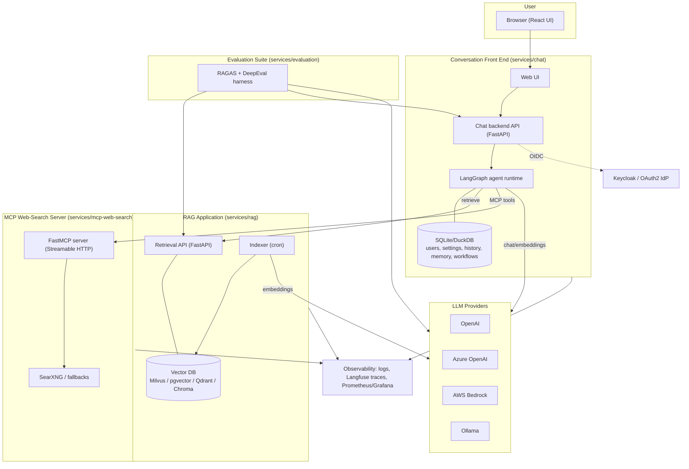
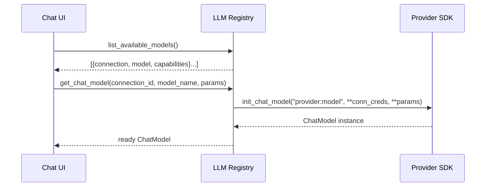
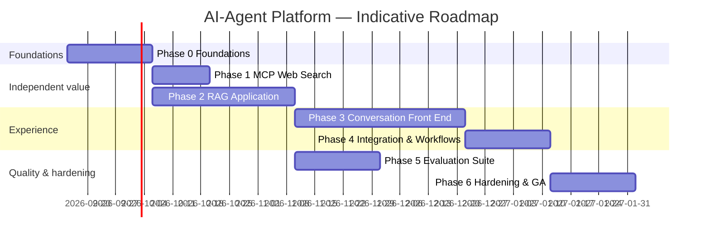

# AI-Agent Platform — Comprehensive Analysis & Design Document

| Field | Value |
|-------|-------|
| **Document** | Comprehensive Analysis & Design |
| **Product** | AI-Agent Platform |
| **Version** | 1.0 (draft) |
| **Date** | September 2026 |
| **Status** | For review |
| **Audience** | Engineering, architecture, product, security, DevOps |

> This is the master document. It covers the whole platform: market context, vision, architecture,
> technology decisions, cross-cutting concerns, deployment, phased roadmap, risks, and the documentation
> plan. Each sub-project has a linked deep-dive under [`docs/subprojects/`](./subprojects/).
>
> **Companion documents:** [`nfr-governance.md`](./nfr-governance.md) (non-functional requirements, cost,
> safety, data governance, feedback loop, and the requirement-traceability matrix) and the
> [ADR log](./adr/README.md) (decision records).

---

## Table of contents

1. [Executive summary](#1-executive-summary)
2. [Market & technology landscape (2026)](#2-market--technology-landscape-2026)
3. [Product vision, goals & non-goals](#3-product-vision-goals--non-goals)
4. [Personas & use cases](#4-personas--use-cases)
5. [System architecture](#5-system-architecture)
6. [The LLM connection registry (multi-connection design)](#6-the-llm-connection-registry-multi-connection-design)
7. [Configuration & secrets model](#7-configuration--secrets-model)
8. [Sub-project summaries](#8-sub-project-summaries)
9. [Cross-cutting concerns](#9-cross-cutting-concerns)
10. [Deployment & Docker strategy](#10-deployment--docker-strategy)
11. [Phased delivery roadmap](#11-phased-delivery-roadmap)
12. [Risks & mitigations](#12-risks--mitigations)
13. [Documentation plan](#13-documentation-plan)
14. [Glossary](#14-glossary)
15. [References](#15-references)

---

## 1. Executive summary

The AI-Agent Platform is a self-hostable system for building and operating LLM-powered assistants. It is
composed of four **independent** sub-projects plus a shared core library:

- **RAG Application** — turns your documents (PDF, images, HTML, Markdown, Office files, and more) into a
  searchable knowledge base with a configurable vector database, configurable open-source embedding
  models, pluggable chunking strategies, and an automatic (cron-scheduled) indexer.
- **Conversation Front End** — a ChatGPT-style web application with login (local admin + Keycloak/OAuth2),
  conversation history, per-conversation settings (model, temperature, memory, system prompt, context
  files), model/connection switching at runtime, image (vision) support, and selectable RAG and MCP tools.
- **MCP Web-Search Server** — a Model Context Protocol server that exposes web-grounding tools backed by
  open-source search (SearXNG by default), discoverable and usable directly from the chat agent.
- **Evaluation Suite** — dedicated, reproducible evaluation for both the RAG pipeline (faithfulness,
  answer relevancy, context precision/recall, plus retrieval metrics) and the conversation agent
  (trajectory, tool-call correctness, answer quality).

The platform is built on **Python + LangChain + LangGraph**. A single **LLM connection registry** lets
operators register *multiple* connections to OpenAI, AWS Bedrock, and Ollama simultaneously; every model
those connections expose becomes selectable at runtime. Everything is driven by **configuration** so the
same code runs against a laptop (Ollama + SQLite + Chroma) or a cluster (Bedrock + Postgres + Milvus).

Each sub-project ships its own container image and Docker Compose profile, so teams adopt only what they
need. Observability (structured logs, tracing, metrics), security (authN/authZ, secrets, prompt-injection
defenses), and testing are treated as first-class, cross-cutting deliverables.

**Delivery is phased** (see §11): foundations → MCP web search → RAG → conversation front end →
integration & workflows → evaluation → hardening. Early phases produce independently useful components.

---

## 2. Market & technology landscape (2026)

This section summarizes the current landscape that informs our technology choices. Sources are listed in
§15. *Content from external sources has been rephrased and summarized for licensing compliance.*

### 2.1 LLM orchestration frameworks

LangChain and LangGraph remain the most widely adopted orchestration stack. Two capabilities are directly
relevant:

- **Unified model access.** LangChain exposes a single API across providers. `init_chat_model` accepts a
  `provider:model` identifier (e.g., `openai:gpt-4o`, `azure_openai:gpt-4o`, `bedrock:anthropic.claude-...`,
  `ollama:llama3.1`) so provider selection is data, not code. Provider packages (`langchain-openai` — which
  also supplies Azure OpenAI, `langchain-aws`, `langchain-ollama`) supply the concrete integrations.
  ([LangChain docs](https://docs.langchain.com/oss/python/langchain/models))
- **Graph-based agent runtime.** `create_agent` builds a LangGraph graph (model node, tool node,
  middleware). LangGraph adds **persistence** via *checkpointers* (state snapshots keyed by `thread_id`
  for conversation memory, resumption, and time-travel debugging) and a **Store** for long-term,
  cross-thread memory, plus native human-in-the-loop. ([LangGraph persistence](https://docs.langchain.com/oss/javascript/langgraph/persistence))

**Implication:** we standardize on `init_chat_model` for provider-agnostic access and LangGraph
checkpointers for conversation memory. This directly satisfies the "any one or all providers, chosen at
runtime" requirement.

### 2.2 Vector databases

The 2026 consensus from multiple comparisons: choose by scale and existing infrastructure rather than
raw benchmarks. ([stork.ai](https://www.stork.ai/blog/best-open-source-vector-databases-2026),
[marsdevs](https://www.marsdevs.com/compare/vector-database-comparison-2026),
[d-central](https://d-central.tech/self-hosted-vector-databases/))

| Vector DB | Sweet spot (2026 guidance) | License |
|-----------|----------------------------|---------|
| **pgvector** | Already run Postgres; up to ~1M vectors; keep vectors + metadata + joins in one ACID DB | PostgreSQL |
| **Qdrant** | Fast, memory-efficient open-source server; native hybrid search | Apache-2.0 |
| **Milvus** | True billion-vector / cluster scale | Apache-2.0 |
| **Chroma** | Easiest local prototyping (`pip install`) | Apache-2.0 |

**Implication:** the RAG app targets a **VectorStore abstraction** (LangChain's interface) with adapters
for **Milvus** and **pgvector** (explicitly requested) plus **Qdrant** and **Chroma** as additional
open-source options. The store is selected by config, with **pgvector as the default** (confirmed) — it
keeps vectors, metadata, and joins in one ACID database and is the pragmatic starting point; Milvus/Qdrant
are available when scale demands.

### 2.3 Embedding models

Strong open, self-hostable options exist; "biggest" is rarely "best" once hardware is considered.
([d-central](https://d-central.tech/local-embedding-models/),
[premai](https://www.premai.io/blog/best-embedding-models-for-rag-2026-ranked-by-mteb-score-cost-and-self-hosting/))

| Model | Notable traits | License |
|-------|----------------|---------|
| **nomic-embed-text** | Ollama-native, ~0.3 GB, easy local start | Apache-2.0 |
| **Qwen3-Embedding-0.6B / 8B** | Best quality-per-VRAM; Ollama-native | Apache-2.0 |
| **BGE-M3** | 8K context, 100+ languages, dense + sparse hybrid | MIT |
| **all-MiniLM-L6-v2** | Lightest CPU-only option (~0.1 GB) | Apache-2.0 |
| **Granite / Nomic (Matryoshka)** | Configurable output dimensions (e.g., 64→768) | Apache-2.0 |

**Implication:** embeddings are **configurable** (model + dimension). Matryoshka-capable models let users
pick a dimension. The RAG app validates that the embedding dimension matches the target collection.

### 2.4 Chunking strategies

Chunking often influences retrieval quality more than the embedding model. A 2026 analysis found the
common "add overlap" default adds little measurable benefit, while **semantic** chunking yields the best
accuracy at higher compute cost. ([digitalapplied](https://www.digitalapplied.com/blog/rag-chunking-strategies-2026-retrieval-quality-playbook),
[dronahq](https://www.dronahq.com/chunking-strategies/))

Strategies to support: fixed-size, recursive, sentence, **semantic**, document-structure-aware,
parent-child, and late chunking. **Implication:** chunking is a configurable strategy per collection.

### 2.5 Document parsing / ingestion

**Docling** (IBM, MIT) parses PDF, Office documents, images (with OCR), HTML, and more into structured
Markdown/JSON purpose-built for RAG, and runs CPU-only. PyMuPDF and `unstructured` are alternatives.
([docling.org](https://docling.org/), [Towards Data Science](https://towardsdatascience.com/parse-pdfs-for-rag-locally-with-docling-rich-tables-no-cloud-upload/))

**Implication:** Docling is the default multi-format parser; a loader abstraction allows per-format
overrides. A directory scanner discovers all supported files for ingestion.

### 2.6 Model Context Protocol (MCP)

MCP is an open JSON-RPC 2.0 standard for exposing **tools**, **resources**, and **prompts** to LLM
clients. The official Python SDK (FastMCP) supports **stdio** and **Streamable HTTP** transports; the
older HTTP+SSE transport was deprecated in the 2025-03-26 revision. Auth uses OAuth 2.1.
([python-sdk](https://github.com/modelcontextprotocol/python-sdk),
[composio](https://composio.dev/blog/mcp-server-step-by-step-guide-to-building-from-scrtch))

**Implication:** the web-search server is a FastMCP server over Streamable HTTP; the chat agent consumes
it through `langchain-mcp-adapters`.

### 2.7 Web-search grounding

**SearXNG** is a self-hosted metasearch engine that fans a query out to many upstream engines with no API
key and no tracking — ideal as a free, open default. Managed options (Tavily, Brave, Firecrawl) and
open-source Tavily-compatible replacements (searCrawl, orio-search) exist as fallbacks.
([dev.to/SearXNG](https://dev.to/greatsage_sh/skip-the-search-api-bill-self-hosting-searxng-for-private-search-and-free-llmrag-web-results-p23),
[vellum](https://www.vellum.ai/blog/best-web-search-apis-and-mcps-for-ai-agents))

**Implication:** SearXNG is the default backend behind a provider abstraction with optional Tavily/Brave/
DuckDuckGo fallbacks.

### 2.8 Conversation UI landscape

**Open WebUI** is the reference self-hosted, ChatGPT-style interface (Ollama + OpenAI-compatible APIs,
document RAG, admin controls). **Chainlit** enables rapid chat UIs. **assistant-ui** / **CopilotKit**
provide headless React chat components. ([Open WebUI](https://github.com/open-webui/open-webui),
[designrevision](https://designrevision.com/alternatives/assistant-ui))

**Decision:** because the requirements are highly custom (admin + Keycloak auth, workflow builder,
per-conversation RAG/MCP selection, vision, memory tuning), we build a **custom FastAPI backend + React
front end**. Open WebUI is a reference for UX, not a base we fork.

### 2.9 Authentication

Keycloak + FastAPI is a well-trodden path: OIDC Authorization Code flow with PKCE, JWT validation against
the realm's JWKS, and role-based access. Libraries include `python-keycloak`, `authlib`, and
`fastapi-keycloak-middleware`. ([skycloak](https://skycloak.io/blog/keycloak-fastapi-python-api-authentication/))

**Implication:** the chat backend supports a **local admin credential** (bootstrap) *and* **Keycloak
OIDC**, selectable by configuration.

### 2.10 Evaluation

The field converges on two dimensions — **retrieval quality** and **generation quality** — implemented by
**RAGAS** (faithfulness, answer relevancy, context precision/recall), **DeepEval** (the "RAG triad" and
conversational metrics), and classic retrieval metrics (Precision@K, NDCG, MRR). LLM-as-judge with a
golden dataset and a regression harness is the standard operating model. ([premai](https://www.premai.io/blog/rag-evaluation-metrics-frameworks-testing-2026/),
[DeepEval](https://deepeval.com/guides/guides-rag-triad))

**Implication:** the evaluation suite combines RAGAS + DeepEval with a curated golden dataset and a
CI-runnable regression harness, plus agent-trajectory and tool-call evaluation.

### 2.11 Key takeaways

1. Provider-agnostic model access (`init_chat_model`) makes the multi-provider, runtime-selection
   requirement natural.
2. Abstract the vector store, embeddings, chunkers, and loaders behind interfaces; select by config.
3. Prefer open, self-hostable defaults (Ollama, SearXNG, open embeddings, pgvector/Qdrant/Milvus) with
   cloud options where they add value.
4. MCP (Streamable HTTP) is the right integration boundary for tools such as web search.
5. Evaluation must be a dedicated, reproducible sub-project, not an afterthought.

---

## 3. Product vision, goals & non-goals

### 3.1 Vision

> A single, self-hostable platform where teams connect the LLMs they already use, ground answers in their
> own documents and the live web, converse through a polished ChatGPT-style UI, and continuously measure
> quality — with every piece usable on its own.

### 3.2 Goals

- **G1 — Multi-provider, multi-connection.** Configure one or many connections to OpenAI, Azure OpenAI,
  Bedrock, and Ollama; expose all their models for runtime selection.
- **G2 — Configurable RAG.** Swap vector DB, embedding model + dimension, chunking strategy, and data
  sources through configuration; ingest many file types; index on a schedule.
- **G3 — Rich conversation UX.** Login, history, settings, model switching, vision, memory tuning, RAG/MCP
  tool selection, and workflow automation.
- **G4 — Web grounding via MCP.** A discoverable MCP server for web search.
- **G5 — First-class evaluation.** Reproducible RAG and agent evaluation with CI integration.
- **G6 — Isolation & portability.** Each sub-project runs independently and ships as a container.
- **G7 — Operable.** Observability, security, and documentation are built in.

### 3.3 Non-goals (initial releases)

- Not building a new base model or fine-tuning pipeline (we consume models).
- Not a general no-code app builder beyond the scoped workflow automation.
- Not a managed multi-tenant SaaS in v1 (multi-user, yes; hard tenant isolation/billing, later).
- Not replacing enterprise IdPs — we integrate with Keycloak/OAuth2 rather than reimplement identity.

### 3.4 Success criteria

- A user can register two different providers, pick a model at runtime, and chat.
- A directory of mixed files can be indexed on a cron schedule and queried from chat.
- The agent can call the web-search MCP tool and cite sources.
- The evaluation suite produces a scored report and fails CI on regression thresholds.
- Each sub-project starts on its own via `docker compose --profile <name> up`.

---

## 4. Personas & use cases

### 4.1 Personas

- **Operator / Admin** — deploys the platform, configures connections, vector stores, data sources, auth,
  and MCP servers.
- **Knowledge worker (end user)** — logs in, chats, switches models, uploads/pastes images, selects
  knowledge bases and tools, revisits history.
- **RAG engineer** — tunes embeddings, chunking, retrieval; owns ingestion sources and schedules.
- **AI quality engineer** — curates golden datasets, runs evaluations, tracks regressions.
- **Security / compliance** — reviews authN/authZ, secrets, data flows, and audit logs.

### 4.2 Representative use cases

1. **Internal knowledge assistant** — index policy/HR/engineering docs; staff ask questions and get cited
   answers.
2. **Research assistant with live web** — combine internal RAG with MCP web search for current facts.
3. **Multimodal Q&A** — paste a screenshot/diagram; ask the model to explain or extract text.
4. **Model comparison** — switch between a local Ollama model and Bedrock/OpenAI in the same conversation
   to compare cost/quality.
5. **Automated workflows** — e.g., "every morning summarize new documents indexed overnight."
6. **Quality gating** — block a deployment if RAG faithfulness or context recall drops below a threshold.

---

## 5. System architecture

### 5.1 Guiding principles

1. **Configuration over code** — behavior is chosen by config; code stays generic.
2. **Clear seams** — sub-projects communicate over stable HTTP/MCP contracts, never shared internals.
3. **Shared core, thin services** — common concerns live in `ai_agent_core`; services stay focused.
4. **Stateless services, stateful stores** — services scale horizontally; state lives in DBs/vector stores.
5. **Secure & observable by default** — auth, secrets, logs, traces, metrics are not optional add-ons.

### 5.2 High-level component view



### 5.3 Monorepo layout

A **monorepo** (single git repo, multiple independently buildable projects) balances isolation with shared
tooling. Managed with **uv** workspaces; each service has its own `pyproject.toml` and lockable deps.

```
ai-agent/
├── packages/
│   └── ai_agent_core/         # shared library
│       ├── llm/               # connection registry, model factory (init_chat_model)
│       ├── config/            # pydantic-settings models, loaders
│       ├── telemetry/         # logging, tracing, metrics helpers
│       ├── schemas/           # shared pydantic/DTO models
│       └── security/          # auth helpers, secret access
├── services/
│   ├── rag/
│   ├── chat/
│   ├── mcp-web-search/
│   └── evaluation/
├── deploy/
│   ├── docker-compose.yml     # single root orchestrator (one service block per sub-project, profiles)
│   ├── .env.example           # copy to .env; used for compose variable substitution
│   └── searxng/               # SearXNG settings (mcp profile)
├── docs/                      # comprehensive-analysis.md, nfr-governance.md, adr/, subprojects/
└── pyproject.toml             # workspace root (tooling: ruff, mypy, pytest)
```

### 5.4 Inter-service contracts

| From → To | Protocol | Contract |
|-----------|----------|----------|
| Chat → RAG | HTTP/REST (OpenAPI) | `POST /v1/retrieve`, collection management |
| Chat → MCP | MCP over Streamable HTTP | tool discovery + invocation |
| Chat → Providers | LangChain provider SDKs | chat + embeddings |
| RAG → Providers | LangChain embeddings | embedding generation |
| Evaluation → RAG/Chat | HTTP/REST | drive pipelines under test |
| All → IdP | OIDC | token issuance/validation |

Contracts are versioned (`/v1`) and published as OpenAPI/JSON-schema so services evolve independently.

### 5.5 Technology stack summary

| Layer | Choice | Rationale |
|-------|--------|-----------|
| Language | Python 3.12+ | Ecosystem alignment with LangChain/LangGraph |
| Orchestration | LangChain, LangGraph | Provider-agnostic models, agent runtime, persistence |
| API framework | FastAPI + Uvicorn | Async, OpenAPI, DI, performance |
| Front end | React + Vite + TypeScript (**confirmed**) | Full control over the custom UX (auth, workflows, tool/RAG selection, vision) |
| Providers | `langchain-openai`, `langchain-aws`, `langchain-ollama` | OpenAI, Azure OpenAI, Bedrock, Ollama (`langchain-openai` serves both OpenAI and Azure) |
| Vector DB | **pgvector (default)**; Milvus, Qdrant, Chroma (pluggable) | ACID + one DB by default; scale up to Milvus/Qdrant when needed |
| Embeddings | HuggingFace/sentence-transformers, Ollama, OpenAI, Azure OpenAI, Bedrock, PostgresML (pluggable) | Open, configurable dims; local, cloud-API, or in-database |
| Doc parsing | Docling (default), PyMuPDF/unstructured (fallbacks) | Multi-format, OCR, CPU-friendly |
| App DB | SQLite (default) / DuckDB (configurable) via SQLAlchemy | Lightweight, embeddable |
| Scheduler | APScheduler (cron expressions) | In-process cron indexing |
| MCP | official `mcp` SDK (FastMCP), `langchain-mcp-adapters` | Standard tool protocol |
| Web search | SearXNG (default); Tavily/Brave/DuckDuckGo (optional) | Free, self-hosted default |
| Auth | Keycloak (OIDC) + local admin; `authlib`/`python-keycloak` | Enterprise SSO + bootstrap |
| Eval | RAGAS, DeepEval | RAG + agent metrics |
| Observability | structlog, OpenTelemetry, Langfuse, Prometheus/Grafana | Logs, traces, metrics |
| Packaging | Docker + Docker Compose (profiles); uv | Isolation, reproducibility |
| Dep/tooling | uv, ruff, mypy, pytest | Fast, modern Python tooling |

---

## 6. The LLM connection registry (multi-connection design)

This subsystem satisfies requirements 2 and 3: *any one or all of OpenAI/Azure OpenAI/Bedrock/Ollama
configurable, with multiple connections each, all selectable at runtime.*

### 6.1 Concepts

- **Provider** — a kind of backend: `openai`, `azure_openai`, `bedrock`, `ollama` (extensible).
- **Connection** — a *named, configured* instance of a provider (credentials + endpoint + defaults). You
  can have many per provider, e.g. `openai-prod`, `azure-openai`, `bedrock-us-east-1`, `ollama-local`.
  Azure connections add `base_url` (the resource endpoint) and `api_version`; each model `name` is the
  Azure deployment name (override with `extra.azure_deployment`).
- **Model descriptor** — a model exposed by a connection, with capabilities (chat, embeddings, vision,
  tools, context window) and a stable **model reference** `("connection_id", "model_name")`.
- **Registry** — loads connections from config, validates them, discovers/declares models, and hands out
  ready-to-use LangChain chat/embedding objects on request.

### 6.2 Model resolution flow



### 6.3 Model discovery per provider

- **Ollama** — query the local/remote Ollama API (`/api/tags`) to list installed models; embeddings vs
  chat inferred from model metadata/config.
- **OpenAI** — list via the models endpoint and/or an allowlist in config (to hide irrelevant models).
- **Bedrock** — enumerate via the Bedrock control-plane API and/or a config allowlist; region-scoped.

Discovery results are cached with a TTL and refreshable on demand. Operators can pin an **allowlist** and
friendly display names so users see a curated list.

### 6.4 Configuration shape (illustrative)

```yaml
llm:
  default_connection: ollama-local
  connections:
    - id: openai-prod
      provider: openai
      api_key: ${OPENAI_API_KEY}
      # optional: base_url for OpenAI-compatible gateways
      models:            # optional allowlist; omit to auto-discover
        - name: gpt-4o
          display_name: "GPT-4o (vision)"
          capabilities: [chat, vision, tools]
        - name: text-embedding-3-large
          capabilities: [embeddings]
          dimensions: 3072
    - id: bedrock-use1
      provider: bedrock
      region: us-east-1
      # credentials via standard AWS chain (env/role/profile)
      auth_profile: default
    - id: ollama-local
      provider: ollama
      base_url: http://ollama:11434
      # models auto-discovered from the Ollama server
```

### 6.5 Design notes

- **Credentials never leave the backend.** The UI receives only non-secret descriptors.
- **Capability flags** drive UX: vision-capable models enable image upload; embedding-capable models are
  offered to the RAG indexer, not the chat picker.
- **Failure isolation.** A misconfigured connection is marked unhealthy and excluded from the picker
  without breaking others; health is surfaced in an admin view.
- **Extensibility.** Adding a provider = implementing a small adapter (discovery + `init_chat_model`
  mapping) and registering it; no changes to consumers.

---

## 7. Configuration & secrets model

### 7.1 Layered configuration

Precedence (highest wins): **runtime/API overrides → environment variables → `.env` file → YAML config
file → built-in defaults**. Implemented with **pydantic-settings** for typed validation and clear errors.

- **Per-service config** — each service reads its own config file (e.g., `rag.yaml`, `chat.yaml`) plus a
  shared `common.yaml` for cross-cutting values (telemetry endpoints, LLM connections).
- **Schema-validated** — invalid config fails fast at startup with actionable messages.
- **Hot-reload (where safe)** — non-secret display settings may reload; connection/security changes require
  restart.

### 7.2 Secrets

- Secrets (API keys, client secrets, DB passwords) are injected via **environment variables** or a
  **secrets file** referenced by env; never committed. `.env.example` templates document required keys.
- Production guidance: source secrets from a manager (Docker/K8s secrets, AWS Secrets Manager, HashiCorp
  Vault). The config layer reads already-resolved env values, so the manager is pluggable.
- **Never log secret values.** Telemetry redacts known secret keys; config `repr` masks sensitive fields.

### 7.3 Configurable storage locations

Per requirements, the app database engine (SQLite/DuckDB) **and file locations** are configurable:

```yaml
storage:
  app_db:
    engine: sqlite            # sqlite | duckdb
    path: /data/chat/app.db
  uploads_dir: /data/chat/uploads      # images, context files
  checkpointer:
    backend: sqlite           # LangGraph conversation memory store
    path: /data/chat/checkpoints.db
```

---

## 8. Sub-project summaries

Each summary links to its deep-dive. Full requirements, data models, APIs, testing, and Docker details
live in the linked documents.

### 8.1 RAG Application → [deep dive](./subprojects/rag.md)

Ingests multi-format documents and serves retrieval. Highlights:

- **Pluggable vector DB** (Milvus, pgvector, Qdrant, Chroma) behind a `VectorStore` abstraction.
- **Configurable embeddings** (model + dimension) with open-source defaults; dimension/collection
  validation.
- **Pluggable chunking** (fixed, recursive, sentence, semantic, structure-aware, parent-child, late).
- **Multi-format ingestion** (PDF, images w/ OCR, HTML, Markdown, Office, and more) via Docling; a
  **directory scanner** discovers supported files when enabled.
- **Cron indexer** using cron expressions; incremental (content-hash change detection); full/partial
  re-index.
- **Retrieval API** (FastAPI) consumed by the chat front end; collection management endpoints.
- **Tested** (unit + integration with ephemeral stores) and **containerized**.

### 8.2 Conversation Front End → [deep dive](./subprojects/conversation-frontend.md)

The end-user chat application. Highlights:

- **Auth**: local **admin** bootstrap credential **and** **Keycloak/OAuth2 OIDC** (config-selectable).
- **Home → chat**, streaming responses, **conversation & chat history**, resume/continue.
- **Settings**: model/connection switch, temperature, memory strategy, system instruction, context files,
  audio, theme, mode; **select RAG collections and MCP servers/tools**.
- **Vision**: paste/upload images; render images returned by the model.
- **Lightweight DB** (SQLite/DuckDB, configurable engine + location) for users, settings, memory, history.
- **MCP client**: list configured servers/tools; the agent selects tools as needed.
- **Workflows**: author multi-step automations on the LangGraph runtime.
- **Logging/monitoring** and thorough documentation.

### 8.3 MCP Web-Search Server → [deep dive](./subprojects/mcp-web-search.md)

- **FastMCP** server (Streamable HTTP) exposing web-grounding **tools** (`web_search`, `fetch_url`, and
  optionally `news_search`).
- **Open-source search** via **SearXNG** by default; optional Tavily/Brave/DuckDuckGo providers.
- **Discoverable** and usable from the chat agent via `langchain-mcp-adapters`.
- Containerized alongside a SearXNG instance.

### 8.4 Evaluation Suite → [deep dive](./subprojects/evaluation.md)

- **RAG evaluation**: RAGAS (faithfulness, answer relevancy, context precision/recall) + retrieval metrics
  (Precision@K, NDCG, MRR).
- **Agent evaluation**: DeepEval conversational metrics, trajectory/tool-call correctness, answer quality,
  LLM-as-judge.
- **Golden datasets**, a **regression harness**, HTML/JSON reports, and **CI gating**.

---

## 9. Cross-cutting concerns

### 9.1 Security

- **AuthN**: OIDC (Keycloak) with Authorization Code + PKCE; local admin for bootstrap. JWTs validated
  against realm JWKS with issuer/audience/expiry checks.
- **AuthZ**: role-based (e.g., `admin`, `user`); admin-only endpoints for connection/config management.
- **Secrets**: env/secret-manager injection; redaction in logs; no secrets in the browser.
- **Input & output safety**: validate uploads (type/size), sandbox file handling, guard against
  **prompt injection** from retrieved/searched content (treat external text as untrusted; use tool-use
  allowlists and system-prompt hardening; never auto-execute instructions found in documents/web).
- **Network**: services isolated on a Docker network; only intended ports published; TLS terminated at a
  reverse proxy in production.
- **Data protection**: PII-aware logging (redaction), configurable retention for conversations, and clear
  data-flow documentation for compliance review.
- **Supply chain**: pinned dependencies, lockfiles, vulnerability scanning (e.g., pip-audit/Trivy) in CI.

> ⚠️ **Network-exposed services (chat API, RAG API, MCP server) must not run unauthenticated.** Each
> exposes health endpoints publicly but gates functional endpoints behind auth/network policy. This is
> called out again in each sub-project doc.

### 9.2 Observability

- **Structured logging** (JSON) via `structlog`, correlation IDs propagated across services.
- **Tracing**: OpenTelemetry spans across HTTP/MCP calls; **Langfuse** (open source) for LLM/RAG/agent
  traces (prompts, tokens, latency, cost, retrieval hits). LangSmith optional.
- **Metrics**: Prometheus counters/histograms (request latency, token usage, retrieval latency, indexer
  runs, error rates) with Grafana dashboards.
- **Audit**: security-relevant events (login, config change, admin actions) recorded.

> **Status (Phase 6 done):** structured logging + a Prometheus `/metrics` endpoint and security/rate-limit
> middleware are wired into the services (`ai_agent_core.web`), and the `observability` Compose profile
> (Prometheus + Grafana + Langfuse) is available. Remaining: wiring Langfuse *tracing* into the agent
> (prompt/token/cost spans) — logs + metrics are in place today.

### 9.3 Testing strategy

| Level | Scope | Tools |
|-------|-------|-------|
| Unit | Pure logic: chunkers, config, registry, adapters | pytest, hypothesis |
| Integration | Services against ephemeral stores (Testcontainers for pgvector/Qdrant/Milvus; temp SQLite) | pytest, testcontainers |
| Contract | OpenAPI/MCP schema conformance between services | schemathesis, JSON-schema |
| E2E | Compose stack up; scripted chat + retrieval + web-search flows | pytest, Playwright (UI) |
| Evaluation | Quality gates on RAG/agent metrics | RAGAS, DeepEval |
| Non-functional | Load/latency smoke, security scans | locust, pip-audit, Trivy |

Coverage targets and per-service specifics live in each deep dive. **Tests are a required deliverable**
per sub-project (explicitly requested for RAG).

### 9.4 Packaging & dependency management

- **uv** workspace at the root; each service pins its own dependencies with a lockfile for reproducible
  builds.
- **Multi-stage Docker** images (builder → slim runtime), non-root users, healthchecks, minimal base
  images. GPU-optional images for local embedding/inference where relevant.

### 9.5 CI/CD

- Pipeline stages: lint (ruff) → type-check (mypy) → unit/integration tests → build images → scan → publish
  → (optional) evaluation gate.
- Each service builds independently; only changed services rebuild (path filters).

---

## 10. Deployment & Docker strategy

### 10.1 Isolation via Compose profiles

Each sub-project is a service (or set of services) with a **Compose profile**, so operators run only what
they need:

```bash
# Run just the MCP web-search server (+ SearXNG)
docker compose --profile mcp up

# Run RAG with pgvector
docker compose --profile rag --profile pgvector up

# Run the full platform
docker compose --profile all up
```

### 10.2 Service/profile matrix (target)

| Profile | Services | Status |
|---------|----------|--------|
| `chat` | chat-frontend, chat-api | ✅ |
| `rag` | rag-api, rag-indexer, pgvector | ✅ |
| `mcp` | mcp-web-search, searxng | ✅ |
| `eval` | evaluation-runner | ✅ |
| `pgvector` | pgvector | ✅ |
| `ollama` | ollama | ✅ |
| `keycloak` | keycloak (dev) | ✅ (used by Phase 3) |
| `observability` | langfuse, prometheus, grafana | ✅ |
| `all` | everything above | — |

The current `deploy/docker-compose.yml` implements the ✅ profiles; additional vector backends
(`qdrant`/`milvus`) remain planned. Legend: ✅ built · 🟡 partial · ⬜ planned.

### 10.3 Environments

- **Local/dev**: Ollama + SQLite + Chroma/pgvector + SearXNG; single machine; hot-reload.
- **Staging/prod**: external Postgres/Milvus, managed secrets, TLS reverse proxy, Keycloak, full
  observability. A Kubernetes/Helm path is a later option; Compose is the v1 target.

### 10.4 Data & volumes

Named volumes for the app DB, uploads, vector store data, and checkpoints. Backup/restore guidance
documented per store. Locations configurable (see §7.3).

---

## 11. Phased delivery roadmap

Phases are ordered so each produces something independently useful. Durations are relative estimates for a
small team and should be refined during planning.



### Phase 0 — Foundations (enables everything)
- Monorepo, uv workspace, tooling (ruff, mypy, pytest), CI skeleton.
- `ai_agent_core`: **LLM connection registry**, config/secrets layer, telemetry helpers, shared schemas.
- Base Docker/Compose scaffolding and `.env` templates.
- **Exit criteria:** register multiple provider connections and get a working chat model from each via a
  smoke test; logs/traces flowing.

### Phase 1 — MCP Web-Search Server (smallest independent win) — ✅ done
- FastMCP server (Streamable HTTP) with `web_search`/`news_search`/`fetch_url`; SearXNG backend; provider
  abstraction (fallback + RRF merge); SSRF-safe fetch + readability extraction; TTL cache.
- Discoverable via MCP; tools verified through `list_tools`/`call_tool`.
- **Exit criteria met:** tools are listed and callable; results structured with sources to cite; runs via
  `docker compose --profile mcp up`.

### Phase 2 — RAG Application — ✅ done
- VectorStore abstraction (**pgvector default**; in-memory for tests; Chroma optional; Milvus/Qdrant
  reserved), configurable embeddings (+ dimension validation), four chunking strategies, native + Docling
  loaders, directory scanner with change detection, incremental/full indexer, APScheduler cron, retrieval API.
- **Exit criteria met:** a mixed-format directory indexes (incrementally, on a cron) and retrieval returns
  cited hits via the API; full pipeline tested end-to-end; runs via `docker compose --profile rag up`.

### Phase 3 — Conversation Front End — ✅ done
- Auth (local admin + OIDC/Keycloak verifier), streaming chat (SSE), history + resume, settings
  precedence, runtime model switching, vision (image upload/paste), SQLite/DuckDB app DB, memory
  windowing; React UI (login, history, streaming transcript, model picker, image paste).
- **Exit criteria met:** log in, chat, switch model mid-session, paste an image, resume a past
  conversation — verified via 26 backend tests (fake model) and a type-checked React build.
- **Deferred to Phase 4:** LangGraph tool-agent (RAG + MCP tool calling) and the workflow builder.

### Phase 4 — Integration & Workflows — ✅ done
- Tool-calling agent wires RAG retrieval + MCP web-search tools into the chat (per-conversation selection
  via settings); answers carry citations + `tools_used`. Workflow engine (llm/rag/tool steps with
  templating) + persistence + API.
- **Exit criteria met:** a conversation using a selected RAG collection + web search cites both (verified
  end-to-end with fakes); a saved workflow runs end-to-end. Real RAG/MCP calls use the running services.
- **Deferred:** token-level streaming through tool calls; a full LangGraph multi-agent runtime.

### Phase 5 — Evaluation Suite — ✅ done
- Retrieval metrics + judge-based RAG/agent metrics, golden datasets, gates, JSON+HTML reports, CI-gating
  CLI. Dependency-free heuristic judge by default; LLM judge / RAGAS / DeepEval pluggable behind the
  `Judge` interface.
- **Exit criteria met:** `eval run --suite rag|agent` produces a scored report and exits non-zero on a
  threshold breach (verified). Real evaluation uses live predictors against the running services.

### Phase 6 — Hardening & GA — ✅ done (operational items ongoing)
- Shared web hardening/observability middleware (Prometheus `/metrics`, security headers, per-client rate
  limiting) wired into the services; observability Compose profile (Prometheus + Grafana + Langfuse); CI
  workflow; [OPERATIONS.md](./OPERATIONS.md) (backup/DR/scaling) + [SECURITY.md](./SECURITY.md) (hardening
  checklist); load-test harness; integration-test scaffolding for the live-service paths.
- **Exit criteria met:** observable (`/metrics` + dashboards), secured (auth, headers, rate limits,
  documented checklist), and runnable via `docker compose --profile all up`.
- **Ongoing operational work** (needs a live deployment): a full security audit, real load/latency runs to
  confirm the SLOs, DR drills, and Langfuse trace wiring into the agent.

---

## 12. Risks & mitigations

| # | Risk | Impact | Likelihood | Mitigation |
|---|------|--------|-----------|------------|
| R1 | Fast-moving LangChain/MCP APIs cause churn | Rework | Med | Pin versions; isolate provider/MCP code behind adapters; upgrade deliberately |
| R2 | Embedding/vector **dimension mismatch** corrupts a collection | Broken retrieval | Med | Validate dim vs collection at startup and before indexing; block on mismatch |
| R3 | **Prompt injection** via retrieved/searched content | Data exfil, misuse | Med | Treat external text as untrusted; tool allowlists; system-prompt hardening; no auto-exec |
| R4 | Local model/hardware limits (VRAM) | Poor UX/perf | Med | Default to small models (nomic/MiniLM); document hardware tiers; allow cloud fallback |
| R5 | Multi-provider **cost** surprises | Budget | Med | Token metering, per-connection quotas, cost dashboards in Langfuse |
| R6 | Scope creep across four sub-projects | Delivery slip | High | Strict phase exit criteria; isolation lets phases ship independently |
| R7 | Secret leakage | Security incident | Low/High | Secret manager, log redaction, scans, least-privilege creds |
| R8 | Vector DB operational burden (Milvus) | Ops load | Med | Default to pgvector/Chroma for small deployments; Milvus only at scale |
| R9 | Unauthenticated exposed endpoints | Breach | Low/High | Auth on all functional endpoints; network isolation; security checklist per service |
| R10 | Docling/OCR parsing gaps on edge documents | Ingestion quality | Med | Loader fallbacks (PyMuPDF/unstructured); per-format overrides; ingestion QA |

---

## 13. Documentation plan

Per requirement 5, **each sub-project ships its own documentation**. Minimum set per sub-project:

- **README** — what it is, quickstart, prerequisites.
- **Architecture** — components, data model, diagrams.
- **Configuration reference** — every setting, defaults, examples, secrets.
- **Startup & operations** — local run, Docker/Compose, health, backup/restore, troubleshooting.
- **API / tool reference** — OpenAPI (services) or MCP tool schemas (MCP server).
- **Testing guide** — how to run unit/integration/e2e and interpret results.
- **Runbook** — common failures and responses; observability dashboards.

Platform-level docs (this document set) cover cross-cutting architecture, security, deployment, and the
roadmap. Docs live beside code and are reviewed with it; diagrams use Mermaid so they render in-repo.

---

## 14. Glossary

| Term | Meaning |
|------|---------|
| **RAG** | Retrieval-Augmented Generation — grounding LLM answers in retrieved documents |
| **MCP** | Model Context Protocol — open standard for exposing tools/resources/prompts to LLM clients |
| **Embedding** | Vector representation of text/data used for similarity search |
| **Chunking** | Splitting documents into retrievable units before embedding |
| **Vector store** | Database optimized for nearest-neighbor search over embeddings |
| **Checkpointer** | LangGraph mechanism that persists agent/graph state per `thread_id` |
| **Connection** | A named, configured instance of an LLM provider |
| **Streamable HTTP** | Current MCP transport (replaced HTTP+SSE in 2025-03-26) |
| **OIDC** | OpenID Connect — identity layer over OAuth2 |
| **LLM-as-judge** | Using an LLM to score outputs against criteria during evaluation |

---

## 15. References

Accessed September 2026. *External content has been rephrased/summarized for licensing compliance.*

**LangChain / LangGraph**
- Providers and models — https://docs.langchain.com/oss/python/concepts/providers-and-models
- Models (`init_chat_model`) — https://docs.langchain.com/oss/python/langchain/models
- Agents (`create_agent`) — https://docs.langchain.com/oss/python/langchain-agents
- LangGraph persistence / checkpointers — https://docs.langchain.com/oss/javascript/langgraph/persistence

**Vector databases**
- Best open-source vector DBs 2026 — https://www.stork.ai/blog/best-open-source-vector-databases-2026
- Vector DB comparison 2026 — https://www.marsdevs.com/compare/vector-database-comparison-2026
- Self-hosted vector DBs 2026 — https://d-central.tech/self-hosted-vector-databases/

**Embeddings**
- Local embedding models 2026 — https://d-central.tech/local-embedding-models/
- Best embedding models (MTEB/cost/self-hosting) — https://www.premai.io/blog/best-embedding-models-for-rag-2026-ranked-by-mteb-score-cost-and-self-hosting/
- Ollama embedding models — https://www.morphllm.com/ollama-embedding-models

**Chunking & parsing**
- Chunking playbook 2026 — https://www.digitalapplied.com/blog/rag-chunking-strategies-2026-retrieval-quality-playbook
- Chunking strategies — https://www.dronahq.com/chunking-strategies/
- Docling — https://docling.org/
- Parse PDFs locally with Docling — https://towardsdatascience.com/parse-pdfs-for-rag-locally-with-docling-rich-tables-no-cloud-upload/

**MCP**
- Official Python SDK — https://github.com/modelcontextprotocol/python-sdk
- Build an MCP server (2026) — https://composio.dev/blog/mcp-server-step-by-step-guide-to-building-from-scrtch
- SSE → Streamable HTTP migration — https://startdebugging.net/2026/07/migrate-an-mcp-server-from-sse-to-streamable-http/

**Web search**
- Self-hosting SearXNG for LLM/RAG — https://dev.to/greatsage_sh/skip-the-search-api-bill-self-hosting-searxng-for-private-search-and-free-llmrag-web-results-p23
- Web search APIs & MCPs for agents 2026 — https://www.vellum.ai/blog/best-web-search-apis-and-mcps-for-ai-agents

**Conversation UI**
- Open WebUI — https://github.com/open-webui/open-webui
- AI chat UI libraries 2026 — https://designrevision.com/alternatives/assistant-ui

**Auth**
- Keycloak + FastAPI — https://skycloak.io/blog/keycloak-fastapi-python-api-authentication/
- FastAPI Keycloak middleware — https://github.com/waza-ari/fastapi-keycloak-middleware

**Evaluation**
- RAG evaluation metrics/frameworks 2026 — https://www.premai.io/blog/rag-evaluation-metrics-frameworks-testing-2026/
- DeepEval RAG triad — https://deepeval.com/guides/guides-rag-triad
- How to evaluate RAG systems — https://atlan.com/know/how-to-evaluate-rag-systems-explained/

---

*End of master document. Continue to the sub-project deep dives in [`docs/subprojects/`](./subprojects/).*
