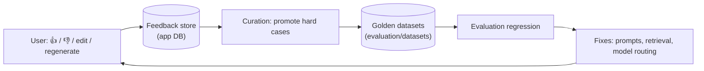

# Non-Functional Requirements, Governance & Operability

*Addendum to the [Comprehensive Analysis & Design](./comprehensive-analysis.md). It consolidates aspects
that were previously implicit or scattered: non-functional requirements and SLOs, cost governance, LLM
safety, data governance/privacy, the user-feedback loop, caching, backup/DR, capacity, i18n, rate
limiting, assumptions/open questions, and a full requirement-traceability matrix.*

> **Phase 6 status:** the operable/secured pieces below are now partly built — Prometheus `/metrics` +
> security headers + per-client rate limiting on the services, an observability Compose profile, a CI
> workflow, and runbooks ([OPERATIONS.md](./OPERATIONS.md), [SECURITY.md](./SECURITY.md)). Items needing a
> live deployment (SLO load runs, security audit, DR drills, Langfuse trace wiring, output-moderation and
> semantic-cache wiring) remain operational follow-ups.

## Table of contents
1. [Requirement traceability matrix](#1-requirement-traceability-matrix)
2. [Non-functional requirements & SLOs](#2-non-functional-requirements--slos)
3. [Cost management & token governance](#3-cost-management--token-governance)
4. [Response & semantic caching](#4-response--semantic-caching)
5. [LLM safety & guardrails](#5-llm-safety--guardrails)
6. [Data governance, privacy & compliance](#6-data-governance-privacy--compliance)
7. [User feedback loop (closing the quality loop)](#7-user-feedback-loop-closing-the-quality-loop)
8. [Backup, restore & disaster recovery](#8-backup-restore--disaster-recovery)
9. [Capacity planning & hardware sizing](#9-capacity-planning--hardware-sizing)
10. [Internationalization & localization](#10-internationalization--localization)
11. [Rate limiting & abuse prevention](#11-rate-limiting--abuse-prevention)
12. [Accessibility](#12-accessibility)
13. [Assumptions, constraints & open questions](#13-assumptions-constraints--open-questions)

---

## 1. Requirement traceability matrix

Every requirement from the original brief, mapped to where it's designed and its build status.
Status: ✅ implemented & tested · 🟡 designed, partially built · ⬜ designed, not yet built.

### Platform-wide

| Req | Requirement | Design | Status |
|-----|-------------|--------|--------|
| P-1 | Python + LangChain + LangGraph | analysis §5.5 | ✅ core + chat + tool-agent (custom loop; LangGraph multi-agent future) |
| P-2 | Connect OpenAI / Bedrock / Ollama; any one or all configurable | analysis §6; `ai_agent_core.llm` | ✅ |
| P-3 | Multiple connections; models chosen at runtime | analysis §6; registry + `/v1/models` | ✅ |
| P-4a | RAG sub-project | [rag.md](./subprojects/rag.md) | ✅ (Phase 2) |
| P-4b | Conversation front-end sub-project | [conversation-frontend.md](./subprojects/conversation-frontend.md) | ✅ (Phase 3) |
| P-4c | MCP web-search sub-project | [mcp-web-search.md](./subprojects/mcp-web-search.md) | ✅ (Phase 1) |
| P-4d | Evaluation sub-project | [evaluation.md](./subprojects/evaluation.md) | ✅ (Phase 5) |
| P-4e | All sub-projects independent & isolated | analysis §10; Compose profiles | ✅ |
| P-5 | Documentation per segment | analysis §13; per-service READMEs | ✅ (for built parts) |

### RAG application

| Req | Requirement | Design | Status |
|-----|-------------|--------|--------|
| RAG-1 | Multiple vector DBs (Milvus, PGVector, other OSS) | rag.md §3 | ✅ memory/pgvector/chroma/qdrant/milvus (lazy-imported; live backends integration-tested) |
| RAG-2 | Configurable OSS embedding model + dimension | rag.md §4 | ✅ hashing/huggingface/ollama/openai/azure_openai/bedrock/postgresml + dimension validation |
| RAG-3 | Configurable chunking strategies | rag.md §5 | ✅ (fixed/recursive/sentence/markdown) |
| RAG-4 | Many file types; scan directory when enabled | rag.md §6 | ✅ native+scan; 🟡 Docling (lazy extra) |
| RAG-5 | Usable by the conversation app | rag.md §8; retrieval API | ✅ API ready; wiring in Phase 4 |
| RAG-6 | Cron-expression indexer | rag.md §7; `scheduler.py` | ✅ |
| RAG-7 | Proper testing | rag.md §11 | ✅ |
| RAG-8 | Docker / Compose packaging | rag.md §12 | ✅ |

### Conversation front end

| Req | Requirement | Design | Status |
|-----|-------------|--------|--------|
| FE-1a | Login: admin credential **and** OAuth2/Keycloak | conversation-frontend.md §3 | ✅ |
| FE-1b | Home page → start chat | §13 | ✅ |
| FE-1c | Settings: model, audio, mode, theme | §6 | ✅ model/theme + audio STT/TTS endpoints (pluggable `SpeechProvider`; Null default → 501 until a real provider is wired) |
| FE-1d | Conversation & chat history | §5 | ✅ |
| FE-1e | Change model, navigate history, continue | §5, §7 | ✅ |
| FE-1f | Memory, temperature, system prompt, context files, RAG/MCP selection | §6, §9 | ✅ memory/temp/prompt + RAG/MCP tool-use + ad-hoc context-file attach (`ContextFile` store + endpoints, injected as delimited reference data) |
| FE-1g | Vision: paste image, show model image output | §8 | ✅ image input + assistant image-output rendering (markdown, `data:` URI, http image URLs) |
| FE-2 | Lightweight DB (SQLite/DuckDB), configurable engine + location | §11 | ✅ |
| FE-3 | List MCP servers/tools; agent selects tools | §9 | ✅ (Phase 4 tool-calling agent) |
| FE-4 | Workflow automation | §10 | ✅ engine + API (visual builder future) |
| FE-5 | Logging, monitoring, documentation | §15 | 🟡 logging + docs ✅; metrics stack Phase 6 |

### MCP web search & Evaluation

| Req | Requirement | Design | Status |
|-----|-------------|--------|--------|
| MCP-1 | Expose web-grounding tools | mcp-web-search.md §4 | ✅ |
| MCP-2 | Open-source web search | §5 (SearXNG) | ✅ |
| MCP-3 | Discoverable from the chat agent | §6 | ✅ (agent calls MCP tools via the toolset; needs live server) |
| EV-1 | Evaluate RAG | evaluation.md §3 | ✅ retrieval + faithfulness/relevancy/context/correctness (heuristic default; LLM/RAGAS pluggable) |
| EV-2 | Evaluate the chat agent | §4 | ✅ tool correctness, task success, safety |

> **Nothing from the original brief is undocumented.** The gaps below are *additional* aspects that a
> production-grade platform needs and that were previously thin or implicit.

---

## 2. Non-functional requirements & SLOs

Indicative targets to design and test against (tune per deployment). These become the basis for load
tests (analysis §9.3) and dashboards.

| Concern | Target (initial) | Notes |
|---------|------------------|-------|
| Chat first-token latency | p95 < 2.5 s (cloud model), < 6 s (local 7–8B) | excludes tool calls; streamed |
| RAG retrieval latency | p95 < 400 ms at ≤ 1M vectors (pgvector, k≤10) | excludes rerank |
| MCP `web_search` latency | p95 < 3 s (SearXNG warm) | cache reduces repeats |
| Indexing throughput | ≥ 20 docs/s parse+chunk (CPU), embed-bound otherwise | batch-tunable |
| Availability (stateless APIs) | 99.5% single-node; higher with replicas | health/readiness gates |
| Concurrency | 50 concurrent chats/node (I/O-bound, async) | scale horizontally |
| Recovery | RPO ≤ 24 h, RTO ≤ 1 h (see §8) | per-datastore backups |

**Scalability model:** all HTTP services are stateless (state lives in Postgres/vector store/app DB), so
they scale horizontally behind a load balancer. The indexer is a scheduled/one-shot worker. Vector search
scales via the chosen store (pgvector → Qdrant/Milvus as volume grows).

---

## 3. Cost management & token governance

LLM usage is the dominant cost; treat it as a first-class, measured resource.

- **Metering:** every model call records tokens in/out, model, connection, user, and conversation
  (Langfuse traces + a metrics counter). Cost is derived per connection using a configurable price table.
  *(Built: `ai_agent_core.build_langfuse_callbacks` constructs Langfuse handlers from `tracing_enabled` +
  `LANGFUSE_*` config and binds them to real models via `apply_callbacks`; opt-in and a no-op when the
  package/keys are absent, so tests and the default install are unaffected. The Langfuse server ships in
  the observability Compose profile.)*
- **Budgets & quotas:** per-user and per-connection soft/hard caps (daily/monthly). Hard cap → graceful
  refusal with a clear message; soft cap → warn + notify admin.
- **Model routing:** default to cheaper/local models; escalate to premium models by policy (e.g., only for
  flagged-hard queries or explicit user choice). The connection registry already enables runtime choice.
- **Context economy:** memory summarization + retrieval top-k limits + prompt templating keep context
  small; caching (§4) avoids repeat spend.
- **Dashboards:** cost by model/connection/user/day in Grafana/Langfuse; alerts on anomalies.

---

## 4. Response & semantic caching

Two cache layers reduce latency and cost:

1. **Exact-match cache** — identical (model, params, prompt) → cached completion (short TTL). Cheap win
   for retries and shared prompts.
2. **Semantic cache** — embed the query; if a prior query is within a similarity threshold, reuse its
   answer (guarded, opt-in, per-conversation off by default to avoid stale/incorrect reuse).

Tool results are already cached (MCP web-search TTL cache). RAG retrieval can cache query→hits per
collection version. Caches must be **invalidated** on collection re-index and respect per-user isolation
for anything containing user data.

> **Built (chat service + core).** An injectable `ResponseCache` (`cache.py`): `NullResponseCache`
> (default, off), `ExactResponseCache` (bounded LRU, keyed by normalised query + model scope), and
> `SemanticResponseCache` (cosine ≥ `cache_similarity_threshold`). Selected via
> `cache_mode = off|exact|semantic`. Semantic mode auto-wires a **registry-backed embedder**
> (`LLMConnectionRegistry.get_embeddings` → `init_embeddings`, added to the core model factory) using the
> first configured embeddings model; it degrades gracefully to exact matching when no embeddings model /
> SDK is available, and per-call embedding failures become cache misses rather than request errors. The
> embedder is still injectable, so tests and the default offline install need no embedding SDK. Because it
> keys on the latest user query, it stays **off by default** with the stale-context caveat documented
> above.

---

## 5. LLM safety & guardrails

Beyond prompt-injection defense (analysis §9.1), a user-facing assistant needs:

- **Input guards:** injection/jailbreak heuristics; treat retrieved/tool/web content as untrusted data
  (delimited, never executed); per-conversation tool allowlists.
- **Output guards:** optional content moderation on model output (self-harm, hate, sexual, violence,
  illicit) using a moderation model/service; block or soften per policy. PII detection/redaction in
  outputs when configured.
- **Grounding & citations:** when RAG/web tools are used, require citations and surface them; flag
  low-grounding answers.
- **Refusals:** consistent, logged refusal messages for disallowed requests; heightened caution after a
  safety trigger.
- **Configurable strictness:** safety profiles (e.g., `standard`, `strict`) selectable by admins.
- **Auditing:** safety events recorded to the audit log.

These guards live in the chat agent middleware (Phase 3) and are evaluated by the safety metrics in the
evaluation suite (evaluation.md §4).

> **Built (chat service).** An injectable `ModerationProvider` (`moderation.py`):
> `AllowAllModerationProvider` (default, off) and a dep-free `KeywordModerationProvider`
> (case-insensitive regex/substring blocklist); API-based providers (OpenAI/Azure content-safety, a local
> classifier) plug in behind the same protocol. Wired into both orchestrators: **input** moderation
> short-circuits before the model call; **output** moderation replaces flagged answers with a consistent,
> logged `moderation_message` (recorded in message meta) and flagged output is never cached. Enabled via
> `moderation_enabled` + `moderation_blocklist`. Grounding/citations and untrusted-content delimiting are
> already implemented (Phase 4 + context-file injection).

---

## 6. Data governance, privacy & compliance

- **Data classification:** documents (potentially sensitive), conversations (user content, possibly PII),
  embeddings (derived), logs/traces (must be scrubbed).
- **Retention:** configurable retention for conversations, uploads, traces; scheduled purge. Default:
  keep conversations until user deletion; traces 30 days.
- **Right to erasure:** per-user "delete my data" removes conversations, uploads, memory, and derived
  vectors tied to the user; documented runbook.
- **PII handling:** redact PII in logs/telemetry; avoid embedding secrets; configurable PII detection on
  ingestion for regulated corpora.
- **Residency & isolation:** self-hostable defaults keep data on-prem; when cloud providers are used, the
  connection/region is explicit and logged. Per-user data isolation enforced in queries.
- **Telemetry privacy:** tracing can be disabled or sampled; prompt/response capture is configurable
  (off/metadata-only/full) to meet privacy needs.
- **Licensing compliance:** models and datasets carry licenses; the platform records the chosen model and
  its license class. Open defaults (Apache/MIT) are preferred; commercial APIs used per their terms.

---

## 7. User feedback loop (closing the quality loop)

The front end and the evaluation suite connect through explicit feedback — a gap worth calling out:

- **Signals captured:** thumbs up/down, message edits, regenerations, copy events, and (optionally) a
  free-text reason. Stored with the conversation, model, and retrieved context.
- **Curation:** negative/edited cases are triaged into the golden datasets, so every real failure becomes
  a regression test (evaluation.md §5).
- **Impact:** feedback trends feed dashboards and prioritize fixes; A/B of prompts/models measured against
  the same datasets.

---

## 8. Backup, restore & disaster recovery

| Datastore | What | Backup | Restore |
|-----------|------|--------|---------|
| Postgres/pgvector | vectors + metadata | `pg_dump` / PITR (WAL) | standard restore; re-index if lost |
| App DB (SQLite/DuckDB) | users, settings, history, memory, workflows | file snapshot / litestream | copy file back |
| Index metadata DB | file hashes + run history | file snapshot | rebuildable by full re-index |
| Uploads store | images, context files | volume/object-store backup | restore volume |
| Config & secrets | YAML + secret manager | version control (no secrets) + manager backup | redeploy |

**Rebuild path:** the vector store is *reconstructable* from source documents via a full re-index, so RPO
for embeddings is effectively the source-of-truth backup. Targets: **RPO ≤ 24 h, RTO ≤ 1 h** (tune per
deployment). DR drills are part of the Phase 6 hardening.

---

## 9. Capacity planning & hardware sizing

| Tier | Hardware | Suggested stack | Scale |
|------|----------|-----------------|-------|
| Laptop / dev | CPU only, 8–16 GB RAM | Ollama small model + all-MiniLM/nomic + SQLite + memory/pgvector + SearXNG | single user, small corpora |
| Team / single server | 1 GPU (12–24 GB), 32–64 GB RAM | Ollama 7–8B or cloud API + BGE-M3 + pgvector | tens of users, ≤ ~1M vectors |
| Org / cluster | multi-GPU or cloud APIs, managed PG/Milvus | premium/local mix + Milvus/Qdrant | many users, 10M+ vectors |

Embedding VRAM/throughput drives ingestion sizing; retrieval scales with the vector store choice; chat
concurrency is I/O-bound and scales with API replicas.

---

## 10. Internationalization & localization

- **Retrieval:** multilingual embeddings (BGE-M3) support cross-lingual corpora.
- **UI:** externalize strings for translation; locale-aware dates/numbers; RTL support as a later
  enhancement.
- **Content:** the agent can be instructed to answer in the user's language; language is a settable
  preference.

---

## 11. Rate limiting & abuse prevention

- **Implemented:** a per-client token-bucket `RateLimitMiddleware` (`ai_agent_core.web`) on the chat/RAG
  services, enabled via `CHAT_RATE_LIMIT_PER_MINUTE` / `RAG_RATE_LIMIT_PER_MINUTE` (0 disables; health +
  `/metrics` exempt). It is per-process — use a shared store (Redis) for multi-replica fairness.
- **API gateway / reverse proxy:** per-IP and per-user rate limits on chat, retrieval, and MCP endpoints.
- **Application quotas:** tie into cost budgets (§3); per-user request ceilings.
- **Upload limits:** type/size caps (already in the frontend design §15) plus optional AV scanning.
- **MCP/tooling:** per-client rate limits to protect upstream search providers (mcp-web-search §8).

---

## 12. Accessibility

Covered in the front-end design ([conversation-frontend.md §13](./subprojects/conversation-frontend.md#13-uiux-design)):
keyboard navigation, ARIA roles, contrast, focus management, screen-reader-friendly streaming. **Full WCAG
conformance requires manual testing with assistive technologies and expert review** and is a Phase 3/6
deliverable.

---

## 13. Assumptions, constraints & open questions

**Assumptions**
- Operators can self-host (Docker) and provide model access (local Ollama and/or provider credentials).
- Corpora fit the chosen vector store's scale tier; pgvector is sufficient for the initial target.
- A single organization/tenant per deployment initially (multi-tenancy is a non-goal for v1).

**Constraints**
- Python ≥ 3.12; open-source-first defaults; runs on CPU (degraded quality) without a GPU.
- LangChain/MCP APIs evolve; provider/MCP code is isolated behind adapters to absorb churn.

**Open questions (to resolve before/with Phase 3–6)**
1. Which moderation model/service for output guards (self-hosted vs API)? (§5)
2. Default conversation/trace retention windows per compliance needs? (§6)
3. Is semantic caching enabled by default, and at what similarity threshold? (§4)
4. Multi-tenant isolation model if/when needed (schema-per-tenant vs row-level)?
5. Kubernetes/Helm packaging timing (Compose is the v1 target)?
6. Reranker model default for RAG (cross-encoder choice, latency budget)?
7. Workflow builder scope for v1 (form/JSON vs visual node editor)?

These are tracked as decisions in the [ADR log](./adr/README.md).
