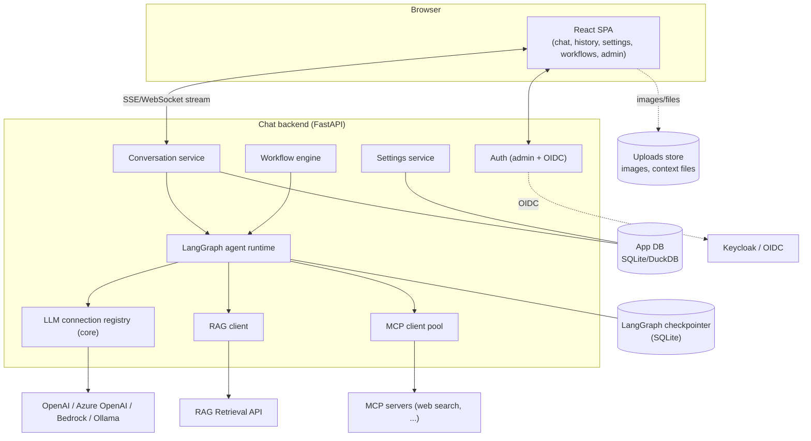

# Conversation Front End — Deep Dive

*Sub-project 2 of the [AI-Agent Platform](../comprehensive-analysis.md). The end-user chat application:
login, conversation, history, settings, model switching, vision, and workflow automation. Independent and
isolated; integrates with the RAG and MCP sub-projects when they are present.*

> **Implementation status: Phases 3–4 implemented.** Auth (local admin + OIDC verifier), streaming chat,
> history + resume, settings precedence, runtime model switching, vision, and the SQLite/DuckDB app DB are
> built and tested (backend 50 tests; the React UI builds). See
> [`services/chat/README.md`](../../services/chat/README.md). **Phase 4 adds** the tool-calling agent
> (RAG retrieval + MCP web search with citations, §4/§9) and the workflow engine (§10). **Also built:**
> ad-hoc **context files** attached per conversation and injected as delimited reference data (§6),
> assistant **image-output rendering** (§8), and **audio STT/TTS endpoints** behind a pluggable
> `SpeechProvider` (Null default → `501` until a real provider is wired; §6). Token-level streaming
> through tool calls, a full LangGraph multi-agent runtime, and in-browser mic capture remain future work.

## Table of contents
1. [Purpose & requirements](#1-purpose--requirements)
2. [Architecture](#2-architecture)
3. [Authentication & authorization](#3-authentication--authorization)
4. [The agent runtime & memory](#4-the-agent-runtime--memory)
5. [Conversation & chat history](#5-conversation--chat-history)
6. [Settings model](#6-settings-model)
7. [Model & connection switching](#7-model--connection-switching)
8. [Vision (images in & out)](#8-vision-images-in--out)
9. [RAG & MCP tool selection](#9-rag--mcp-tool-selection)
10. [Workflow automation](#10-workflow-automation)
11. [Lightweight database](#11-lightweight-database)
12. [Data model](#12-data-model)
13. [UI/UX design](#13-uiux-design)
14. [Configuration reference](#14-configuration-reference)
15. [Logging, monitoring & security](#15-logging-monitoring--security)
16. [Testing strategy](#16-testing-strategy)
17. [Docker & deployment](#17-docker--deployment)
18. [Documentation deliverables](#18-documentation-deliverables)

---

## 1. Purpose & requirements

A polished, ChatGPT-style experimental chat application that ties the platform together. Requirements
mapping:

| Req | Requirement | Where |
|-----|-------------|-------|
| FE-1a | Login: local admin credential **and** OAuth2/OIDC IdP (Keycloak) | [§3](#3-authentication--authorization) |
| FE-1b | Home page with option to start a chat | [§13](#13-uiux-design) |
| FE-1c | Settings: model, audio, mode, theme, etc. | [§6](#6-settings-model) |
| FE-1d | Conversation & chat history | [§5](#5-conversation--chat-history) |
| FE-1e | Change model, navigate history, continue conversation | [§5](#5-conversation--chat-history), [§7](#7-model--connection-switching) |
| FE-1f | Memory, temperature, system instruction, context files, RAG/MCP selection, and more | [§6](#6-settings-model), [§9](#9-rag--mcp-tool-selection) |
| FE-1g | Vision: paste/copy images; show model image output | [§8](#8-vision-images-in--out) |
| FE-2 | Lightweight DB (SQLite/DuckDB), configurable engine + file location | [§11](#11-lightweight-database) |
| FE-3 | List configured MCP servers/tools; agent selects tools as needed | [§9](#9-rag--mcp-tool-selection) |
| FE-4 | Create workflows to automate tasks | [§10](#10-workflow-automation) |
| FE-5 | Logging, monitoring, documentation | [§15](#15-logging-monitoring--security), [§18](#18-documentation-deliverables) |

### Front-end technology decision

**Decision (confirmed): a custom React + Vite + TypeScript front end against a FastAPI backend.** The
requirements are highly custom (admin + Keycloak auth, per-conversation RAG/MCP selection, workflow
builder, vision, memory tuning), so rather than fork an existing app we build our own. Open WebUI serves
as a **UX reference**, not a base.

Rationale: full control over the workflow builder, tool/RAG selection UX, and memory settings; clean
separation of a reusable backend API (also usable headlessly) from the presentation layer.

---

## 2. Architecture



The backend is stateless per request except for streaming connections; all durable state lives in the app
DB, the checkpointer, and the uploads store — all with configurable locations.

---

## 3. Authentication & authorization

### 3.1 Two modes (config-selectable, can coexist)

1. **Local admin credential** — a bootstrap admin defined by config/env (username + hashed password). Lets
   the platform run before an IdP is wired up, and provides break-glass admin access. Password stored as a
   strong hash (argon2/bcrypt); never plaintext.
2. **Keycloak / OAuth2 (OIDC)** — standard **Authorization Code flow with PKCE**. The browser is redirected
   to Keycloak; the backend exchanges the code, validates the **JWT** against the realm **JWKS**
   (issuer/audience/expiry), and establishes a session.

```yaml
auth:
  mode: both              # local | oidc | both
  local_admin:
    username: admin
    password_hash: ${ADMIN_PASSWORD_HASH}
  oidc:
    issuer: https://keycloak.example.com/realms/ai-agent
    client_id: ai-agent-chat
    client_secret: ${OIDC_CLIENT_SECRET}
    redirect_uri: https://chat.example.com/auth/callback
    scopes: [openid, profile, email]
```

### 3.2 Sessions & tokens

- Server-side session (secure, http-only, same-site cookie) mapping to the validated identity.
- Access tokens kept **server-side**; the SPA never handles raw provider secrets.
- Token refresh handled by the backend; logout revokes the session and (for OIDC) triggers RP-initiated
  logout.

### 3.3 Roles

- Roles from OIDC claims (or `admin` for the local admin). Baseline roles: **`admin`** (manage
  connections, MCP servers, RAG collections, users' visibility of shared resources) and **`user`**
  (chat, own history/settings).
- Authorization enforced by FastAPI dependencies; admin-only routes for platform configuration.

### 3.4 Library choice

`authlib` (OIDC client) + `python-keycloak` (admin/introspection where needed), or
`fastapi-keycloak-middleware` for a batteries-included path. JWT validated via cached JWKS.

---

## 4. The agent runtime & memory

### 4.1 LangGraph agent

Each turn runs through a **LangGraph** agent graph: model node → optional tool nodes (RAG retrieve, MCP
tools) → response. Built with `create_agent` and extended with middleware for context assembly (system
prompt, memory, retrieved context, attached files).

### 4.2 Memory layers

| Layer | Mechanism | Scope |
|-------|-----------|-------|
| **Short-term (thread)** | LangGraph **checkpointer** keyed by `thread_id` (= conversation id) | Within a conversation; enables resume/continue |
| **Rolling window / summary** | Configurable: keep last N turns and/or a running summary to fit context | Within a conversation |
| **Long-term** | LangGraph **Store** (per-user memory namespace) | Across conversations (opt-in per user) |

Memory behavior is tunable in settings (§6): window size, summarization on/off, long-term memory on/off.

### 4.3 Streaming

Responses stream token-by-token to the UI over **SSE** (or WebSocket), including tool-call status events
("searching the web…", "retrieving from *company-handbook*…") so the user sees progress.

---

## 5. Conversation & chat history

- Every conversation is a **thread** with a stable id (also the checkpointer `thread_id`).
- **History sidebar** lists conversations (title auto-generated from the first message, editable), with
  search, pin, rename, delete, and archive.
- **Continue anywhere**: opening a past conversation restores full message history and the checkpointer
  state, so the user can keep going — even after switching models.
- **Message-level actions**: copy, regenerate, edit-and-resend, branch (fork a conversation from a point),
  and view citations/tool calls for a message.
- History is **per-user** and stored in the app DB; messages reference any attached files/images.

---

## 6. Settings model

Settings apply at three levels with clear precedence: **per-message override → per-conversation → user
defaults → system defaults**.

| Group | Settings |
|-------|----------|
| **Model** | Connection + model (§7), max output tokens, top-p |
| **Generation** | **Temperature**, presence/frequency penalties, stop sequences |
| **Memory** | Window size, summarization on/off, long-term memory on/off, "forget" controls |
| **System instruction** | Custom **system prompt** / persona per conversation or saved as a reusable preset |
| **Context files** | Attach files used as ad-hoc context for the conversation (separate from indexed RAG) |
| **Knowledge (RAG)** | Select which RAG collection(s) are active (§9) |
| **Tools (MCP)** | Enable/disable specific MCP servers/tools (§9) |
| **Audio** | Speech-to-text (input) and text-to-speech (output) on/off, voice/model selection |
| **Mode** | e.g., chat / concise / creative / tool-heavy "agent" mode presets |
| **Appearance** | **Theme** (light/dark/system), font size, message density |

Settings persist in the app DB. Presets (system prompts, mode bundles) are savable and reusable.

---

## 7. Model & connection switching

- The model picker is populated by the **LLM connection registry** (see the [master doc §6](../comprehensive-analysis.md#6-the-llm-connection-registry-multi-connection-design)):
  it lists every model across **all healthy connections** (multiple OpenAI/Azure OpenAI/Bedrock/Ollama connections at
  once), grouped by connection with capability badges (vision, tools).
- **Switch mid-conversation**: because history lives in the thread/checkpointer independent of the model,
  the user can change connection/model between turns and continue seamlessly. The chosen model is recorded
  per message for traceability and cost attribution.
- **Capability-aware UX**: selecting a non-vision model disables image upload for that turn; embedding-only
  models never appear in the chat picker.

---

## 8. Vision (images in & out)

- **Input**: users **paste** (clipboard), **drag-drop**, or upload images. Images are stored in the
  uploads store and attached to the message as multimodal content parts for vision-capable models.
- **Output**: images returned or referenced by the model are rendered inline in the chat transcript;
  generated/derived images are saved to the uploads store and linked from the message.
- **Guards**: type/size validation, dimension limits, optional downscaling, and per-model capability
  checks. Non-vision models receive a graceful fallback (e.g., "this model can't read images").

---

## 9. RAG & MCP tool selection

### 9.1 RAG selection
- Settings expose the RAG collections discovered from the **RAG Retrieval API** (`GET /v1/collections`).
- The user selects one or more active collections per conversation. When active, a **retrieval tool** is
  available to the agent; retrieved chunks are injected as grounded context and **citations** are shown in
  the answer.

### 9.2 MCP servers & tools
- Configured MCP servers are listed (name, transport, discovered tools). The chat backend maintains an
  **MCP client pool** (via `langchain-mcp-adapters`) and exposes the tools to the agent.
- Users enable/disable specific servers/tools per conversation. The **agent selects which tool to call**
  based on the request (e.g., web search for current facts); the UI streams tool-call status and results.

```yaml
mcp:
  servers:
    - id: web-search
      transport: streamable_http
      url: http://mcp-web-search:8090/mcp
      enabled_by_default: true
    # add more MCP servers here; tools are auto-discovered
```

### 9.3 Tool-selection safety
- Tools are **allowlisted** per conversation; the agent cannot call disabled tools.
- Content returned by tools/RAG is treated as **untrusted data** (prompt-injection defense, §15).

---

## 10. Workflow automation

Users can compose **workflows** — saved, multi-step automations executed on the LangGraph runtime — to
automate repetitive tasks.

- **Model**: a workflow is a graph of steps (LLM step, RAG retrieve, MCP tool call, transform/branch,
  human-approval step). Stored as a versioned definition in the app DB.
- **Authoring**: start with a **form/JSON-based builder** (choose steps, wire inputs/outputs); a visual
  node editor is a later enhancement.
- **Triggers**: manual ("Run"), scheduled (cron), or from a conversation ("run workflow X on this").
- **Human-in-the-loop**: steps can pause for approval/edits using LangGraph interrupts, then resume.
- **Observability**: each run is traced (inputs, step outputs, tokens, duration) and viewable in history.

Example workflow: *"Every morning, retrieve documents indexed in the last 24h from `company-handbook`,
summarize them, and post the summary to a chosen channel."*

---

## 11. Lightweight database

Per FE-2, a lightweight, embeddable database with a **configurable engine and file location**.

- **Engines**: **SQLite** (default) or **DuckDB**, selected by config. Accessed via **SQLAlchemy** so the
  schema is engine-portable; migrations via Alembic.
- **What it stores**: users, sessions, settings/presets, conversations, messages, attachments metadata,
  memory records, MCP/RAG selections, workflow definitions and runs, audit log.
- **LangGraph checkpointer**: conversation thread state uses the SQLite checkpointer (separate file), so
  chat memory survives restarts.
- **Location configurable** (see master doc §7.3): app DB path, uploads dir, checkpointer path.

Guidance: SQLite is ideal for single-node deployments; DuckDB suits analytical/local use. For multi-node
scale-out, the same SQLAlchemy layer can target Postgres later without app changes.

---

## 12. Data model

```
users(id, subject, source[local|oidc], email, display_name, role, created_at)
sessions(id, user_id, created_at, expires_at)
conversations(id, user_id, title, created_at, updated_at, archived, pinned)
messages(id, conversation_id, role[user|assistant|tool|system], content_json,
         connection_id, model_name, tokens_in, tokens_out, created_at)
attachments(id, message_id, kind[image|file], path, mime, size)
settings(id, scope[user|conversation], owner_id, json)
presets(id, user_id, kind[system_prompt|mode], name, json)
memory(id, user_id, namespace, key, value_json, updated_at)      # long-term store
mcp_selections(conversation_id, server_id, tool_name, enabled)
rag_selections(conversation_id, collection, enabled)
workflows(id, user_id, name, version, definition_json, created_at)
workflow_runs(id, workflow_id, status, started_at, finished_at, trace_ref)
audit_log(id, user_id, action, target, metadata_json, created_at)
```

Message `content_json` supports multimodal parts (text + image references) for vision.

---

## 13. UI/UX design

- **Login** → **Home** (recent conversations, "New chat", quick model picker) → **Chat**.
- **Chat view**: streaming transcript, composer with image paste/upload and mic (audio), per-message
  actions, visible citations and tool-call chips, model indicator with quick-switch.
- **History sidebar**: searchable, pin/rename/archive/delete, branch.
- **Settings panel**: grouped as in §6; live-applies where safe.
- **Workflows**: list, builder, run history.
- **Admin area** (admin role): LLM connections health, MCP servers, RAG collections visibility, users,
  audit log.
- **Accessibility**: keyboard navigation, ARIA roles, sufficient contrast, focus management, and
  screen-reader-friendly streaming updates. (Full WCAG conformance requires manual testing with assistive
  technologies and expert review.)
- **Responsive** layout; light/dark/system themes.

---

## 14. Configuration reference

```yaml
service:
  host: 0.0.0.0
  port: 8080
  public_url: https://chat.example.com

auth:            # see §3
storage:         # app DB engine/path, uploads dir, checkpointer path (master §7.3)
llm:             # LLM connections (shared core; master §6)
rag:
  api_base_url: http://rag-api:8081
mcp:             # MCP servers (see §9.2)
defaults:
  model: { connection: ollama-local, name: llama3.1 }
  temperature: 0.7
  memory: { window: 12, summarize: true, long_term: false }
  theme: system
audio:
  stt: { enabled: false, model: whisper-local }
  tts: { enabled: false, voice: default }
limits:
  max_upload_mb: 20
  max_context_files: 10
```

---

## 15. Logging, monitoring & security

**Logging & monitoring** (FE-5)
- Structured JSON logs with correlation + conversation ids; audit log for auth and admin actions.
- Metrics: active sessions, messages/min, tokens per connection/model (cost), tool-call counts, error
  rates, stream latency.
- Tracing: each turn traced end-to-end (prompt assembly → model → tools → response) to **Langfuse** for
  prompt/cost/latency analysis.

**Security**
- The chat API is **network-exposed and must not run unauthenticated** — all functional endpoints require
  a valid session; only health endpoints are public.
- **Prompt-injection defense**: content from RAG and MCP tools is inserted as clearly delimited, untrusted
  data; the system prompt instructs the model to treat it as reference only and never follow embedded
  instructions; tools are allowlisted per conversation; no automatic execution of instructions found in
  documents or web results.
- **Uploads**: validated (type/size), stored outside the web root, served via authenticated endpoints;
  optional AV scan hook.
- **Secrets**: provider keys and client secrets live server-side only; redacted in logs.
- **Data retention**: configurable conversation/history retention and per-user delete (privacy).
- **PII**: use redaction in logs; document data flows for compliance.

---

## 16. Testing strategy

| Level | What | Tools |
|-------|------|-------|
| Unit | Settings precedence, memory windowing/summary, auth token validation, model-picker capability logic | pytest |
| Integration | Auth flows (local + mocked OIDC), conversation CRUD, checkpointer persistence, RAG/MCP client adapters (mocked) | pytest, respx |
| Contract | Chat API OpenAPI; RAG client vs RAG OpenAPI; MCP tool discovery | schemathesis |
| E2E | Login → chat across two providers → switch model → paste image → resume history → run a workflow | Playwright + Compose |
| Non-functional | Streaming latency smoke, upload limits, authz negative tests, dependency scans | locust, pip-audit |

Targets: core backend services ≥ 80% coverage; every auth mode and the vision path covered; E2E happy-path
in CI against a Compose stack with a mock IdP.

---

## 17. Docker & deployment

- **Images**: `chat-api` (FastAPI) and `chat-frontend` (static React served by nginx or the API).
- **Compose profile** `chat`; depends on `rag` (optional), `mcp` (optional), `keycloak` (if OIDC),
  `ollama`/providers, and `observability`.

```yaml
# excerpt from deploy/docker-compose.yml (chat profile); the real file uses build: + inline env
services:
  chat-api:
    image: ai-agent/chat-api
    profiles: ["chat", "all"]
    ports: ["8080:8080"]
    env_file: [../env/chat.env]
    volumes: ["chatdata:/data/chat"]
    depends_on: [keycloak]
    healthcheck:
      test: ["CMD", "curl", "-f", "http://localhost:8080/healthz"]
  chat-frontend:
    image: ai-agent/chat-frontend
    profiles: ["chat", "all"]
    ports: ["3000:80"]
    depends_on: [chat-api]
volumes: { chatdata: {} }
```

Run independently (chat only, pointing at existing services): `docker compose --profile chat up`.

---

## 18. Documentation deliverables

- **README** — overview + quickstart (log in as admin, first chat).
- **Auth guide** — local admin + Keycloak realm/client setup, roles, PKCE flow.
- **User guide** — chat, history, settings, model switching, vision, RAG/MCP selection, workflows.
- **Configuration reference** — every setting incl. DB engine/location, audio, limits.
- **Admin guide** — managing connections, MCP servers, RAG collections, users, retention.
- **API reference** — generated OpenAPI + streaming/event docs.
- **Operations/runbook** — DB backup/restore, checkpointer maintenance, common auth/streaming issues.
- **Testing guide** — running unit/integration/E2E suites with a mock IdP.
