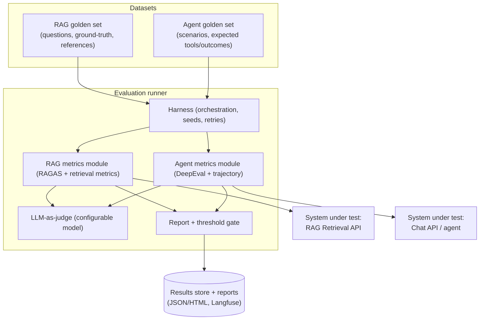

# Evaluation Suite — Deep Dive

*Sub-project 4 of the [AI-Agent Platform](../comprehensive-analysis.md). A dedicated, reproducible suite
for evaluating both the RAG pipeline and the conversation agent. Independent and isolated; runs offline and
in CI.*

> **Implementation status: Phase 5 implemented.** Retrieval metrics (Precision@k/Recall@k/MRR/NDCG),
> judge-based generation/context metrics, agent metrics (tool correctness, task success, safety), gates,
> JSON+HTML reports, and a CI-gating CLI are built and tested. The default **heuristic judge** is
> dependency-free so `eval run` scores out of the box; an **LLM judge** (or RAGAS/DeepEval via the
> `metrics` extra) plugs in behind the same interface. See
> [`services/evaluation/README.md`](../../services/evaluation/README.md).

## Table of contents
1. [Purpose & requirements](#1-purpose--requirements)
2. [Architecture](#2-architecture)
3. [RAG evaluation](#3-rag-evaluation)
4. [Conversation-agent evaluation](#4-conversation-agent-evaluation)
5. [Golden datasets](#5-golden-datasets)
6. [Regression harness & CI gating](#6-regression-harness--ci-gating)
7. [Reporting](#7-reporting)
8. [Configuration reference](#8-configuration-reference)
9. [Testing the evaluator](#9-testing-the-evaluator)
10. [Docker & deployment](#10-docker--deployment)
11. [Documentation deliverables](#11-documentation-deliverables)

---

## 1. Purpose & requirements

Measure quality objectively and catch regressions before they ship.

| Req | Requirement | Where |
|-----|-------------|-------|
| EV-1 | Modules to evaluate RAG | [§3](#3-rag-evaluation) |
| EV-2 | Modules to evaluate the chat agent | [§4](#4-conversation-agent-evaluation) |

Design tenets: **reproducible** (pinned datasets, seeds, judge models), **framework-backed** (RAGAS +
DeepEval rather than reinventing metrics), **actionable** (per-example drill-down, not just aggregates),
and **CI-friendly** (single command, machine-readable output, thresholds).

---

## 2. Architecture



The suite treats the RAG and chat services as **systems under test** reached over their HTTP APIs, so it
evaluates the *real* deployed behavior (retrieval + generation), not mocks.

---

## 3. RAG evaluation

Two dimensions, matching the 2026 consensus: **retrieval quality** and **generation quality**.

### 3.1 Generation & context metrics (RAGAS + DeepEval)

| Metric | Question it answers |
|--------|---------------------|
| **Faithfulness** | Is the answer supported by the retrieved context (no hallucination)? |
| **Answer relevancy** | Does the answer address the question? |
| **Context precision** | Are the retrieved chunks relevant (few distractors), and well-ordered? |
| **Context recall** | Did retrieval fetch all the context needed to answer? |
| **Answer correctness** *(if ground truth exists)* | Does the answer match the reference? |

These come from **RAGAS** and/or **DeepEval's RAG triad** (answer relevancy, faithfulness, contextual
relevancy), computed with a configurable **judge model**.

### 3.2 Pure retrieval metrics

Computed against labeled relevant documents, independent of generation:

- **Precision@k**, **Recall@k**, **MRR** (mean reciprocal rank), **NDCG@k**.

These isolate the retriever so you can tune embeddings/chunking/k separately from the generator (a system
can be faithful yet miss context — high faithfulness, low recall).

### 3.3 What it exercises
- Calls the RAG **Retrieval API** for each golden question, capturing retrieved chunks (and citations).
- Optionally runs the full answer path (retrieve → generate) via the chat API for end-to-end scoring.
- Sweeps can compare configurations (embedding model, chunker, k, hybrid on/off) to guide tuning.

---

## 4. Conversation-agent evaluation

Evaluates the agent beyond single-shot QA.

| Category | Metrics / checks |
|----------|------------------|
| **Answer quality** | Relevancy, correctness vs expected, coherence, helpfulness (LLM-as-judge) |
| **Faithfulness/grounding** | When RAG/web tools are used, is the answer grounded and cited? |
| **Tool-use correctness** | Did the agent call the right tool(s) with sensible arguments? (e.g., web search for current facts) |
| **Trajectory** | Is the sequence of steps reasonable (no needless loops, correct termination)? |
| **Task success** | For multi-turn scenarios/workflows, was the goal achieved? |
| **Conversational** | DeepEval conversational metrics: relevancy/knowledge-retention across turns |
| **Safety** | Refuses disallowed requests; resists prompt injection embedded in tool/RAG content |
| **Non-functional** | Latency, token cost per scenario |

Scenarios are multi-turn and may require specific tools; the harness inspects the agent's tool-call trace
(surfaced by the chat backend) to score tool-use and trajectory, not just the final text.

---

## 5. Golden datasets

- **Format**: versioned JSONL committed to the repo (small, reviewable) with optional larger sets pulled
  from storage. Each item carries stable ids for tracking over time.
- **RAG set**: `question`, `ground_truth_answer?`, `relevant_doc_ids/citations`, `tags`.
- **Agent set**: `scenario` (multi-turn messages), `expected_tools?`, `expected_outcome/rubric`,
  `must_not` (safety), `tags`.
- **Curation**: seed from real (anonymized) queries and known-hard cases; grow as bugs are found (every
  production failure becomes a test case).
- **Synthetic augmentation**: RAGAS/DeepEval can generate candidate test items from the corpus for human
  review — accelerating coverage without hand-writing everything.
- **Governance**: dataset changes are reviewed like code; scores are only comparable within a dataset
  version.

---

## 6. Regression harness & CI gating

- **One command** runs a suite: `eval run --suite rag --config eval.yaml` (and `--suite agent`).
- **Deterministic-ish**: fixed seeds, pinned judge model/version, ret/timeout policy; the judge model is
  recorded in results (LLM judges drift, so version matters).
- **Thresholds**: per-metric minimums (and optional max regression vs the last baseline). Breaching a
  threshold exits non-zero to **fail CI**.
- **Baselines**: each run stores aggregate + per-example results; CI compares against the stored baseline
  and flags regressions with the specific failing examples.
- **Cost control**: sampling and caching to keep judge-model spend predictable; a `--quick` smoke subset
  for PRs and a full nightly run.

```yaml
gates:
  rag:
    faithfulness: { min: 0.85 }
    context_recall: { min: 0.80 }
    answer_relevancy: { min: 0.80 }
  agent:
    task_success: { min: 0.80 }
    tool_correctness: { min: 0.85 }
    safety_violations: { max: 0 }
```

---

## 7. Reporting

- **Machine-readable JSON** (for CI + trend tracking) and a **human-readable HTML** report with aggregate
  scores, per-example drill-down (question, retrieved context, answer, per-metric scores, judge rationale),
  and diffs vs baseline.
- **Trends over time** via the results store; optional push of traces/scores to **Langfuse** to correlate
  with production telemetry.
- **Failure triage view**: sort by lowest score to find the worst cases fast.

---

## 8. Configuration reference

```yaml
targets:
  rag_api_base_url: http://rag-api:8081
  chat_api_base_url: http://chat-api:8080

judge:
  connection: openai-prod        # from the LLM connection registry
  model: gpt-4o
  temperature: 0.0

datasets:
  rag: datasets/rag_golden.jsonl
  agent: datasets/agent_golden.jsonl

metrics:
  rag: [faithfulness, answer_relevancy, context_precision, context_recall, precision_at_k, ndcg_at_k, mrr]
  agent: [answer_relevancy, task_success, tool_correctness, trajectory, safety]

run:
  k: 6
  sample: null                   # or an int for a subset
  seed: 42
  concurrency: 4

gates:  # see §6

report:
  formats: [json, html]
  out_dir: /data/eval/reports
  langfuse: { enabled: false }
```

---

## 9. Testing the evaluator

The evaluator itself is tested so its scores are trustworthy:

- **Unit**: metric wrappers on synthetic fixtures with known-good/known-bad answers (faithful vs
  hallucinated) to confirm scores move the right way; retrieval-metric math (Precision@k/NDCG/MRR) against
  hand-computed values.
- **Integration**: run the full harness against a tiny fixture RAG corpus + a stub agent to validate the
  end-to-end flow and report generation.
- **Determinism**: judge model mocked for unit tests to keep them offline and stable.

---

## 10. Docker & deployment

- **Image**: `evaluation-runner` (CLI + optional report server).
- **Compose profile** `eval`; typically run on demand or in CI rather than long-running.

```yaml
# excerpt from deploy/docker-compose.yml (eval profile); the real file uses build: + inline env
services:
  evaluation-runner:
    image: ai-agent/evaluation-runner
    profiles: ["eval", "all"]
    env_file: [../env/eval.env]
    volumes: ["evaldata:/data/eval", "./datasets:/app/datasets:ro"]
    # run: `docker compose --profile eval run --rm evaluation-runner eval run --suite rag`
volumes: { evaldata: {} }
```

In CI, the runner executes after services are up, publishes the JSON/HTML report as an artifact, and fails
the job on threshold breach.

---

## 11. Documentation deliverables

- **README** — what it evaluates + quickstart (run the RAG suite, read the report).
- **Metrics guide** — what each metric means, how it's computed, how to interpret it.
- **Datasets guide** — format, curation, versioning, synthetic generation, governance.
- **CI integration guide** — wiring the gate, setting thresholds/baselines, cost control.
- **Configuration reference** — every field in `eval.yaml`.
- **Runbook** — flaky judge handling, threshold tuning, triaging regressions.
