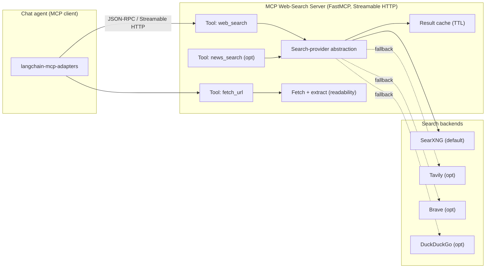

# MCP Web-Search Server — Deep Dive

*Sub-project 3 of the [AI-Agent Platform](../comprehensive-analysis.md). A Model Context Protocol server
that exposes web-grounding tools, discoverable and usable from the chat agent. Independent and isolated.*

> **Implementation status: Phase 1 complete.** `web_search`, `news_search`, and `fetch_url` are
> implemented over a pluggable provider chain (SearXNG default; fallback + RRF merge), with SSRF-safe
> fetching, readability extraction, and TTL caching, all covered by tests. See
> [`services/mcp-web-search/README.md`](../../services/mcp-web-search/README.md). Bearer-token auth and
> rate limiting remain config-reserved for a later hardening pass.

## Table of contents
1. [Purpose & requirements](#1-purpose--requirements)
2. [What is MCP and why](#2-what-is-mcp-and-why)
3. [Architecture](#3-architecture)
4. [Exposed tools](#4-exposed-tools)
5. [Search-provider abstraction](#5-search-provider-abstraction)
6. [Discovery & use from the chat agent](#6-discovery--use-from-the-chat-agent)
7. [Configuration reference](#7-configuration-reference)
8. [Security](#8-security)
9. [Testing strategy](#9-testing-strategy)
10. [Docker & deployment](#10-docker--deployment)
11. [Documentation deliverables](#11-documentation-deliverables)

---

## 1. Purpose & requirements

Give the conversation agent **live web grounding** through a standard, discoverable interface.

| Req | Requirement | Where |
|-----|-------------|-------|
| MCP-1 | Expose tools for web grounding | [§4](#4-exposed-tools) |
| MCP-2 | Use open-source web search APIs | [§5](#5-search-provider-abstraction) |
| MCP-3 | Discoverable & usable from the chat agent | [§6](#6-discovery--use-from-the-chat-agent) |

---

## 2. What is MCP and why

The **Model Context Protocol** is an open **JSON-RPC 2.0** standard for exposing **tools**, **resources**,
and **prompts** to LLM clients over a uniform interface. The official **Python SDK (FastMCP)** supports
**stdio** and **Streamable HTTP** transports; the older HTTP+SSE transport was deprecated in the
2025-03-26 revision. Using MCP means any MCP-capable client (our chat agent, plus Claude/Cursor/etc.) can
discover and call our web-search tools without bespoke integration.

We use **Streamable HTTP** so the server runs as a networked service the chat backend connects to.

---

## 3. Architecture



The server is intentionally small and stateless (aside from a short-lived result cache). It delegates
actual searching to a **provider abstraction** so backends are swappable by config.

---

## 4. Exposed tools

| Tool | Input | Output | Notes |
|------|-------|--------|-------|
| **`web_search`** | `query: str`, `max_results: int=5`, `time_range?`, `lang?` | Ranked results: `title`, `url`, `snippet`, `published?`, `source` | The core grounding tool |
| **`fetch_url`** | `url: str`, `max_chars?` | Clean extracted main text + metadata (title, byline, published) | For reading a specific result |
| **`news_search`** *(optional)* | `query`, `max_results`, `time_range` | Recent news results | Recency-biased variant |

Design notes:
- **Grounding-friendly output**: each result includes a URL so the agent can **cite sources**; snippets
  are concise to control token use.
- **`fetch_url`** separates *finding* from *reading*: the agent searches, then fetches the most relevant
  page(s) for full context. Extraction uses a readability approach to strip nav/ads.
- **Tool descriptions** are written for the model (clear when-to-use guidance) so tool selection is
  reliable.
- Tools return **structured content**; errors are returned as structured, model-readable messages (e.g.,
  rate-limited, no results) rather than raising opaque failures.

---

## 5. Search-provider abstraction

```python
class SearchProvider(Protocol):
    name: str

    def search(self, query: str, *, max_results: int, **opts) -> list[SearchResult]: ...
```

| Provider | Type | Key needed | Default |
|----------|------|-----------|---------|
| **SearXNG** | Self-hosted metasearch (fans out to many engines) | No | ✅ default |
| **DuckDuckGo** | Free/no-key library | No | optional |
| **Tavily** | Managed, agent-optimized | Yes | optional |
| **Brave Search** | Managed API | Yes | optional |

- **SearXNG is the default**: free, open-source, no API key, self-hostable, and privacy-preserving; it
  aggregates results from many upstream engines. It ships in the same Compose stack.
- **Fallback chain**: providers are tried in configured order; if the primary returns nothing or errors, the
  next is used. Results can optionally be merged and re-ranked (reciprocal rank fusion).
- **Caching**: a short TTL cache de-duplicates identical queries to cut latency and load.

---

## 6. Discovery & use from the chat agent

- The chat backend registers this server in its **MCP config** (`url`, transport `streamable_http`) and
  connects using **`langchain-mcp-adapters`**, which turns MCP tools into LangChain tools the LangGraph
  agent can call.
- On connect, the client **lists tools** (names, descriptions, schemas). No hard-coding: adding a tool on
  the server makes it available to the agent after reconnect.
- In the chat UI, the server appears under **Tools (MCP)**; users can enable/disable it per conversation
  (see the [conversation front-end doc §9](./conversation-frontend.md#9-rag--mcp-tool-selection)).
- The agent decides when to call `web_search`/`fetch_url` based on the query and tool descriptions; results
  are grounded into the answer with citations.

---

## 7. Configuration reference

```yaml
server:
  host: 0.0.0.0
  port: 8090
  path: /mcp                 # Streamable HTTP endpoint
  transport: streamable_http

search:
  provider_order: [searxng, duckduckgo]   # fallback chain
  searxng:
    base_url: http://searxng:8080
  duckduckgo: {}
  tavily:
    api_key: ${TAVILY_API_KEY}            # optional
  brave:
    api_key: ${BRAVE_API_KEY}             # optional
  defaults:
    max_results: 5
    safe_search: moderate
    lang: en
  cache:
    ttl_seconds: 300

fetch:
  max_chars: 8000
  timeout_seconds: 20
  user_agent: "ai-agent-mcp-web-search/1.0"

auth:
  # optional: require a bearer token for tool calls when exposed beyond the internal network
  bearer_token: ${MCP_BEARER_TOKEN}
```

---

## 8. Security

- **Server-Side Request Forgery (SSRF)**: `fetch_url` validates URLs, blocks private/link-local/loopback
  ranges and non-http(s) schemes, limits redirects, and enforces timeouts and size caps.
- **Untrusted content**: fetched/searched text is data, not instructions. The chat agent applies
  prompt-injection defenses; the server labels content as external.
- **AuthN when exposed**: within the Compose network the server is reachable only by the chat backend; if
  exposed beyond it, require a **bearer token** (OAuth 2.1 per MCP guidance for production).
- **Rate limiting & quotas** per client to protect upstreams and control cost of paid providers.
- **No secrets in results/logs**; provider API keys via env only.

---

## 9. Testing strategy

| Level | What | Tools |
|-------|------|-------|
| Unit | Provider adapters (result mapping), fallback ordering, RRF merge, URL/SSRF validation, cache TTL | pytest |
| Integration | Against a local **SearXNG** container; live `web_search`/`fetch_url` round-trips | pytest + testcontainers |
| MCP contract | Tool discovery + JSON-RPC schema conformance over Streamable HTTP; validate with MCP Inspector/client | mcp client, schema checks |
| Resilience | Provider timeouts/errors trigger fallback; rate-limit handling; malformed pages | pytest with fault injection |

Targets: adapters and URL-safety logic ≥ 90% coverage; a mocked-provider suite runs on every PR;
SearXNG-backed integration runs nightly.

---

## 10. Docker & deployment

- **Images**: `mcp-web-search` (FastMCP server) plus a **SearXNG** service.
- **Compose profile** `mcp` runs both. The chat stack points at `http://mcp-web-search:8090/mcp`.

```yaml
# excerpt from deploy/docker-compose.yml (mcp profile); the real file uses build: + inline env
services:
  mcp-web-search:
    image: ai-agent/mcp-web-search
    profiles: ["mcp", "all"]
    ports: ["8090:8090"]
    env_file: [../env/mcp.env]
    depends_on: [searxng]
    healthcheck:
      test: ["CMD", "curl", "-f", "http://localhost:8090/healthz"]
  searxng:
    image: searxng/searxng:latest
    profiles: ["mcp", "all"]
    volumes: ["./searxng:/etc/searxng:ro"]
    environment:
      SEARXNG_BASE_URL: http://searxng:8080/
```

Run independently: `docker compose --profile mcp up`, then point any MCP client at the endpoint.

---

## 11. Documentation deliverables

- **README** — what it does + quickstart (start server, call `web_search` from an MCP client).
- **Tool reference** — each tool's schema, examples, and when-to-use guidance.
- **Provider guide** — configuring SearXNG and optional Tavily/Brave/DuckDuckGo; fallback behavior.
- **Integration guide** — registering the server in the chat backend; enabling it in the UI.
- **Security guide** — SSRF protections, auth when exposed, rate limits.
- **Testing guide** — running mocked and SearXNG-backed suites; using the MCP Inspector.
