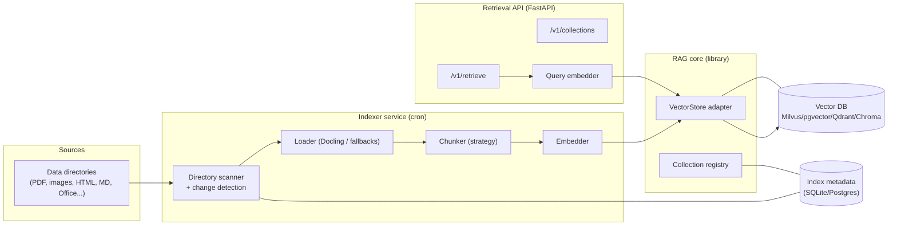

# RAG Application — Deep Dive

*Sub-project 1 of the [AI-Agent Platform](../comprehensive-analysis.md). Independent and isolated: runs on
its own or alongside the conversation front end.*

> **Implementation status: Phase 2 complete.** Pluggable vector stores (pgvector default; in-memory for
> tests), configurable embeddings (hashing/HF/Ollama) + dimension validation, four chunking strategies,
> native + Docling loaders, directory scanning with change detection, incremental/full indexing, an
> APScheduler cron indexer, and the retrieval API are implemented and tested end-to-end. See
> [`services/rag/README.md`](../../services/rag/README.md). The pgvector path requires a live database
> (Docker `rag` profile); automated tests use the dependency-free in-memory path.

## Table of contents
1. [Purpose & requirements](#1-purpose--requirements)
2. [Architecture](#2-architecture)
3. [Vector store abstraction](#3-vector-store-abstraction)
4. [Embeddings (configurable model + dimension)](#4-embeddings-configurable-model--dimension)
5. [Chunking strategies](#5-chunking-strategies)
6. [Multi-format ingestion & directory scanning](#6-multi-format-ingestion--directory-scanning)
7. [The cron indexer](#7-the-cron-indexer)
8. [Retrieval API (integration with the front end)](#8-retrieval-api-integration-with-the-front-end)
9. [Data model](#9-data-model)
10. [Configuration reference](#10-configuration-reference)
11. [Testing strategy](#11-testing-strategy)
12. [Docker & deployment](#12-docker--deployment)
13. [Observability & security](#13-observability--security)
14. [Documentation deliverables](#14-documentation-deliverables)

---

## 1. Purpose & requirements

The RAG Application ingests an organization's documents into a searchable knowledge base and serves
retrieval to any consumer (primarily the conversation front end). It maps directly to the user's RAG
requirements:

| Req | Requirement | Where addressed |
|-----|-------------|-----------------|
| RAG-1 | Support different vector DBs (Milvus, pgvector, other OSS) | [§3](#3-vector-store-abstraction) |
| RAG-2 | Configurable open-source embedding model + dimension | [§4](#4-embeddings-configurable-model--dimension) |
| RAG-3 | Configurable chunking strategies | [§5](#5-chunking-strategies) |
| RAG-4 | Ingest many file types; scan directory when enabled | [§6](#6-multi-format-ingestion--directory-scanning) |
| RAG-5 | Usable by the front-end conversation app | [§8](#8-retrieval-api-integration-with-the-front-end) |
| RAG-6 | Cron-expression scheduled indexer | [§7](#7-the-cron-indexer) |
| RAG-7 | Proper testing | [§11](#11-testing-strategy) |
| RAG-8 | Packaged with Docker (Compose) | [§12](#12-docker--deployment) |

### Design tenets
- **Everything pluggable, selected by config**: store, embeddings, chunker, loader.
- **Collections are self-describing**: each records its embedding model, dimension, chunker, and distance
  metric so retrieval is always consistent with indexing.
- **Incremental & idempotent indexing**: re-running the indexer only processes changed files.

---

## 2. Architecture



Two runnable components share the same **RAG core** library:

- **Indexer** — batch/scheduled process that scans sources, parses, chunks, embeds, and upserts vectors.
- **Retrieval API** — online FastAPI service that embeds queries and returns ranked chunks with metadata
  and citations.

Splitting them lets you scale/serve retrieval continuously while indexing runs periodically, and lets the
indexer run as a one-shot job or a long-lived scheduler.

---

## 3. Vector store abstraction

### 3.1 Interface

A thin `VectorStoreAdapter` protocol wraps LangChain's `VectorStore` so the rest of the code is
store-agnostic:

```python
class VectorStoreAdapter(Protocol):
    def ensure_collection(self, spec: CollectionSpec) -> None: ...
    def upsert(self, chunks: list[Chunk], embeddings: list[Vector]) -> None: ...
    def delete_by_source(self, source_id: str) -> None: ...
    def search(self, query_vector: Vector, k: int, filter: Filter | None) -> list[Hit]: ...
    def hybrid_search(self, query_vector: Vector, query_text: str, k: int) -> list[Hit]: ...
```

### 3.2 Supported backends

| Backend | Package | When to use | Hybrid search |
|---------|---------|-------------|---------------|
| **Chroma** | `langchain-chroma` | Local prototyping, tests | Limited |
| **pgvector** | `langchain-postgres` | Already on Postgres; ≤ ~1M vectors; metadata + joins | Via SQL + FTS |
| **Qdrant** | `langchain-qdrant` | Open-source production; native hybrid | Native (dense + sparse) |
| **Milvus** | `langchain-milvus` | Billion-scale / clustered | Native |

Selection is by config (`vector_store.backend`); the **default is `pgvector`**. A **factory** instantiates
the right adapter. Adding a backend = one new adapter class; consumers are unchanged.

### 3.3 Collection specification

Each collection is created from a `CollectionSpec` that pins retrieval-critical parameters:

```yaml
collections:
  - name: company-handbook
    embedding_ref: bge-m3-1024          # references an embeddings profile (§4)
    dimension: 1024                     # must match the profile output dim
    distance: cosine                    # cosine | l2 | ip
    chunker_ref: semantic-default       # references a chunker profile (§5)
    hybrid: true                        # enable sparse+dense where supported
    sources: [handbook-dir]             # references data sources (§6)
```

The **dimension is validated** against the embedding profile at startup and before each index run (risk
R2). A mismatch aborts with a clear error rather than silently corrupting the collection.

---

## 4. Embeddings (configurable model + dimension)

### 4.1 Embedding profiles

Users define named **embedding profiles** so the same model settings are reused across collections and by
the query path (indexing and querying must use the *same* embedder):

```yaml
embeddings:
  profiles:
    - id: bge-m3-1024
      provider: huggingface           # huggingface | ollama | openai
      model: BAAI/bge-m3
      dimension: 1024                  # for Matryoshka models; else the model's native dim
      normalize: true
      device: cpu                      # cpu | cuda
      batch_size: 32
    - id: nomic-ollama
      provider: ollama
      model: nomic-embed-text
      base_url: http://ollama:11434
    - id: minilm-cpu
      provider: huggingface
      model: sentence-transformers/all-MiniLM-L6-v2
      dimension: 384
```

### 4.2 Model guidance (open-source defaults)

| Profile | Model | Dim | Notes |
|---------|-------|-----|-------|
| Lightweight CPU | all-MiniLM-L6-v2 | 384 | Fast, tiny (~0.1 GB); good default for tests/small corpora |
| Balanced local | nomic-embed-text | 768 | Ollama-native, ~0.3 GB |
| Quality/VRAM | Qwen3-Embedding-0.6B | up to 1024 | Strong quality per VRAM; Ollama-native |
| Multilingual/hybrid | BGE-M3 | up to 1024 | 8K context, 100+ languages, dense + sparse |

### 4.3 Configurable dimensions

For **Matryoshka**-capable models (e.g., Nomic v1.5, Granite r2), the profile's `dimension` truncates the
output vector to the requested size, trading a little accuracy for storage/speed. The adapter records the
chosen dimension in the collection metadata and enforces consistency.

### 4.4 Interface

```python
class Embedder(Protocol):
    id: str
    dimension: int

    def embed_documents(self, texts: list[str]) -> list[Vector]: ...
    def embed_query(self, text: str) -> Vector: ...
```

---

## 5. Chunking strategies

### 5.1 Strategy interface

```python
class Chunker(Protocol):
    def split(self, doc: ParsedDocument) -> list[Chunk]: ...
```

Chunkers receive the **structured** parse (headings, tables, page/section boundaries) from the loader so
structure-aware strategies can respect document layout.

### 5.2 Supported strategies

| Strategy | How it splits | Best for | Cost |
|----------|---------------|----------|------|
| **Fixed-size** | N tokens/chars, optional overlap | Uniform text, baselines | Low |
| **Recursive** | Split on separators (¶, sentence, word) to a target size | General purpose default | Low |
| **Sentence** | Sentence boundaries grouped to size | Short-answer QA | Low |
| **Semantic** | Group by embedding similarity / topic shifts | Knowledge bases, technical docs (best accuracy) | High |
| **Structure-aware** | Respect headings/sections/tables | Structured docs, Markdown, HTML | Med |
| **Parent-child** | Small child chunks for search, larger parent returned for context | Precision + context | Med |
| **Late chunking** | Embed long context first, then pool per chunk | Long, cohesive docs | High |

Defaults follow 2026 guidance: **recursive** as the safe general default, **semantic** where accuracy
matters most. Overlap is configurable but off by default (little measured benefit per recent analysis).

### 5.3 Chunker profiles

```yaml
chunkers:
  profiles:
    - id: recursive-default
      strategy: recursive
      target_tokens: 512
      overlap_tokens: 0
    - id: semantic-default
      strategy: semantic
      breakpoint_percentile: 95
      max_tokens: 1024
    - id: parent-child
      strategy: parent_child
      child_tokens: 256
      parent_tokens: 1024
```

Each chunk carries metadata: `source_id`, `path`, `page`/`section`, `chunk_index`, `content_hash`, and any
document-level metadata (title, author, mtime).

---

## 6. Multi-format ingestion & directory scanning

### 6.1 Loader abstraction

```python
class DocumentLoader(Protocol):
    supported_extensions: set[str]

    def load(self, path: Path) -> ParsedDocument: ...
```

**Docling** is the default loader (PDF, DOCX, PPTX, XLSX, images with OCR, HTML, Markdown, and more →
structured document). Per-format overrides allow swapping in specialized loaders:

| Format | Default | Fallback/alternative |
|--------|---------|----------------------|
| PDF | Docling | PyMuPDF (fast text), unstructured |
| Images (PNG/JPG/TIFF) | Docling OCR | Tesseract |
| HTML | Docling | BeautifulSoup/unstructured |
| Markdown | Structure-aware Markdown loader | Docling |
| DOCX/PPTX/XLSX | Docling | python-docx / python-pptx |
| Plain text/CSV | Native | — |

A loader **registry** maps extensions to loaders; unknown/binary types are skipped and logged.

### 6.2 Data sources & directory scanning

Sources are configured; when a directory source is enabled, the scanner **recursively discovers all
supported files**:

```yaml
sources:
  - id: handbook-dir
    type: directory
    path: /data/rag/handbook
    recursive: true
    include: ["**/*.pdf", "**/*.md", "**/*.html", "**/*.docx", "**/*.png"]
    exclude: ["**/drafts/**"]
    follow_symlinks: false
```

Other source types (S3/object storage, a single file, a URL list) can be added behind the same
`DataSource` interface later.

### 6.3 Change detection (incremental indexing)

The scanner records per-file **content hash + size + mtime** in the index-metadata DB. On each run it
classifies files as **new / changed / unchanged / deleted**:

- new/changed → parse, chunk, embed, upsert; old chunks for that `source_id` removed first.
- deleted → remove the file's vectors.
- unchanged → skipped (idempotent, cheap re-runs).

This keeps the vector store in sync with the source directory without full re-embedding.

---

## 7. The cron indexer

### 7.1 Scheduling

The indexer uses **APScheduler** with **cron expressions** so operators control exactly when indexing
runs. Each collection (or source) can have its own schedule:

```yaml
indexer:
  timezone: UTC
  jobs:
    - collection: company-handbook
      cron: "0 2 * * *"        # daily at 02:00
      mode: incremental        # incremental | full
    - collection: news-cache
      cron: "*/30 * * * *"     # every 30 minutes
      mode: incremental
  concurrency: 2               # parallel file processing
  on_start_run: false          # optionally index once on boot
```

### 7.2 Run modes

- **incremental** (default) — only new/changed/deleted files (see §6.3).
- **full** — re-parse and re-embed everything (used after changing chunker/embedding settings).

### 7.3 Operational behavior

- **Locking** prevents overlapping runs for the same collection.
- **Batch + backpressure**: files processed in configurable batches; embedding calls batched.
- **Resumability**: progress checkpointed per file so a crash resumes without redoing completed work.
- **Manual trigger**: `POST /v1/index/run` (admin) to run a job on demand.
- **Metrics/logs**: files scanned/changed/failed, chunks produced, vectors upserted, duration.

### 7.4 Deployment shapes

- **Scheduler mode** — long-lived container holding the cron loop (default).
- **One-shot mode** — container/CLI that runs once and exits; schedule it with external cron/K8s CronJob
  if preferred.

---

## 8. Retrieval API (integration with the front end)

A FastAPI service exposes retrieval so the conversation front end (or any client) can query without
knowing store internals. This satisfies RAG-5.

### 8.1 Key endpoints (v1)

| Method | Path | Purpose |
|--------|------|---------|
| `GET` | `/v1/collections` | List collections + their embedding/chunker/dimension metadata |
| `POST` | `/v1/retrieve` | Retrieve top-k chunks for a query (optionally hybrid, with filters) |
| `POST` | `/v1/index/run` | Trigger an index job (admin) |
| `GET` | `/v1/index/status` | Last/next run, counts, health |
| `GET` | `/healthz`, `/readyz` | Liveness/readiness |

### 8.2 Retrieve request/response (illustrative)

```jsonc
// POST /v1/retrieve
{
  "collection": "company-handbook",
  "query": "What is the parental leave policy?",
  "k": 6,
  "mode": "hybrid",                 // dense | hybrid
  "filters": { "path": {"$contains": "hr/"} },
  "rerank": true                    // optional cross-encoder rerank
}
```
```jsonc
{
  "hits": [
    {
      "text": "…policy text…",
      "score": 0.82,
      "citation": { "path": "hr/leave.pdf", "page": 3, "title": "Leave Policy" },
      "chunk_id": "…", "source_id": "…"
    }
  ],
  "used": { "embedding": "bge-m3-1024", "reranker": "bge-reranker-base" }
}
```

### 8.3 Retrieval features

- **Hybrid search** (dense + sparse) where the backend supports it (Qdrant/Milvus natively; pgvector via
  FTS).
- **Optional reranking** with a cross-encoder for precision.
- **Metadata filtering** (path, type, tags, date) for scoped retrieval.
- **Citations** returned with every hit so the front end can attribute answers.
- **Consistency guarantee**: the API always embeds queries with the *same* profile the collection was
  indexed with.

### 8.4 Integration contract

The API is published as **OpenAPI** and versioned (`/v1`). The chat backend calls it as an HTTP client;
the two deploy and scale independently. A thin Python client can be shared via `ai_agent_core` for typed
access.

---

## 9. Data model

**Vector store** (per collection): vector, text, and metadata (`source_id`, `path`, `page/section`,
`chunk_index`, `content_hash`, document metadata, tags).

**Index-metadata DB** (SQLite by default; Postgres option):

```
sources(id, type, path, config_json)
files(id, source_id, path, content_hash, size, mtime, status, last_indexed_at)
collections(name, embedding_ref, dimension, distance, chunker_ref, hybrid, created_at)
index_runs(id, collection, mode, started_at, finished_at, scanned, changed, failed, vectors_upserted, status)
```

This DB drives change detection, run history, and status reporting; it holds no secrets.

---

## 10. Configuration reference

A single `rag.yaml` (plus env for secrets) assembles the pieces already shown:

```yaml
service:
  host: 0.0.0.0
  port: 8081

index_metadata_db:
  engine: sqlite
  path: /data/rag/index.db

vector_store:
  backend: pgvector           # chroma | pgvector | qdrant | milvus
  pgvector:
    dsn: ${RAG_PGVECTOR_DSN}
  # qdrant: { url: ..., api_key: ... }
  # milvus: { uri: ..., token: ... }

embeddings:   # profiles (see §4)
chunkers:     # profiles (see §5)
sources:      # data sources (see §6)
collections:  # collection specs (see §3.3)
indexer:      # cron jobs (see §7)

retrieval:
  default_k: 6
  rerank:
    enabled: false
    model: BAAI/bge-reranker-base
```

Everything except secrets can live in the YAML; secrets (DSNs, API keys) come from env. Config is
schema-validated at startup.

---

## 11. Testing strategy

Per RAG-7, testing is a required deliverable.

| Level | What | How |
|-------|------|-----|
| **Unit** | Chunkers (boundaries, sizes), loader registry, dimension validation, change detection, config parsing | pytest; golden fixtures per format; property tests for chunk sizing |
| **Integration** | Real vector stores via **Testcontainers** (pgvector, Qdrant, Milvus) and in-memory Chroma; index → retrieve round-trips | pytest + testcontainers |
| **Ingestion** | Sample corpus of each supported format (small PDFs, images w/ text, HTML, MD, DOCX); assert parse + chunk counts and OCR text presence | fixture corpus committed under `tests/data` |
| **API/contract** | OpenAPI conformance; retrieve response schema; error paths | schemathesis |
| **Retrieval quality (smoke)** | Tiny labeled set; assert expected chunk appears in top-k | pytest; thresholds |
| **Scheduler** | Cron parsing, incremental vs full, locking, resume-after-crash | pytest with time control |

Deeper retrieval-quality measurement (RAGAS/retrieval metrics) is owned by the **Evaluation Suite** and
runs against this service.

**Targets:** ≥ 85% line coverage on the core library; every supported format has at least one ingestion
test; CI runs unit + integration (pgvector + Chroma) on each PR, with Milvus/Qdrant on a nightly job.

---

## 12. Docker & deployment

Per RAG-8, the app is containerized and orchestrated with Docker Compose.

- **Images**: `rag-api` and `rag-indexer` (share a base image with the RAG core; different entrypoints).
  Multi-stage builds, non-root user, healthchecks.
- **Compose profiles**: `rag` (api + indexer), plus a chosen store profile (`pgvector` | `qdrant` |
  `milvus`) and optionally `ollama` for local embeddings.

```yaml
# excerpt from deploy/docker-compose.yml (rag + pgvector profiles); the real file uses build: + inline env
services:
  rag-api:
    image: ai-agent/rag-api
    profiles: ["rag", "all"]
    ports: ["8081:8081"]
    env_file: [../env/rag.env]
    volumes: ["ragdata:/data/rag"]
    depends_on: [pgvector]
    healthcheck:
      test: ["CMD", "curl", "-f", "http://localhost:8081/healthz"]
  rag-indexer:
    image: ai-agent/rag-indexer
    profiles: ["rag", "all"]
    env_file: [../env/rag.env]
    volumes: ["ragdata:/data/rag", "corpus:/data/rag/handbook:ro"]
    depends_on: [pgvector]
  pgvector:
    image: pgvector/pgvector:pg16
    profiles: ["pgvector", "all"]
    environment: { POSTGRES_PASSWORD: ${PG_PASSWORD} }
    volumes: ["pgdata:/var/lib/postgresql/data"]
volumes: { ragdata: {}, pgdata: {}, corpus: {} }
```

Run independently: `docker compose --profile rag --profile pgvector up`.

---

## 13. Observability & security

**Observability**
- Structured logs with correlation IDs; per-run indexer summaries.
- Metrics: retrieval latency/p95, hits returned, index run duration, files changed/failed, embedding
  throughput.
- Traces: retrieve path (embed → search → rerank) exported via OpenTelemetry; RAG traces to Langfuse.

**Security**
- The retrieval API is **network-exposed**, so functional endpoints require auth (service token or the
  platform's OIDC) and are placed behind the internal network; only `/healthz` is unauthenticated.
- Ingested content is **untrusted**: retrieved text is returned as data, never executed; the chat agent
  applies prompt-injection defenses (documented in the chat deep dive).
- Uploaded/scanned files validated by type/size; parsing runs with resource limits; no shell-outs on
  untrusted content beyond sandboxed OCR.
- Secrets (DSNs, API keys) via env/secret manager; never logged.

---

## 14. Documentation deliverables

Shipped with the sub-project (per platform Documentation Plan):

- **README** — overview + quickstart (index a sample dir, run a query).
- **Configuration reference** — every field in `rag.yaml`, with examples per vector store.
- **Ingestion guide** — supported formats, loader overrides, directory-source setup.
- **Embeddings & chunking guide** — choosing models/dimensions and strategies, with tradeoffs.
- **Indexer/operations guide** — cron setup, run modes, manual triggers, backup/restore per store.
- **API reference** — generated OpenAPI + examples.
- **Testing guide** — running unit/integration tests and the ingestion fixtures.
- **Runbook** — dimension mismatch, store connectivity, OCR failures, slow retrieval.
