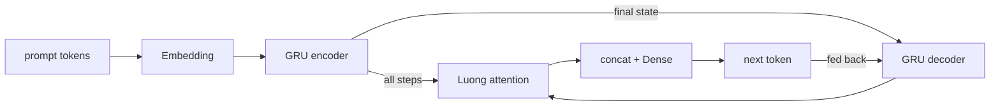
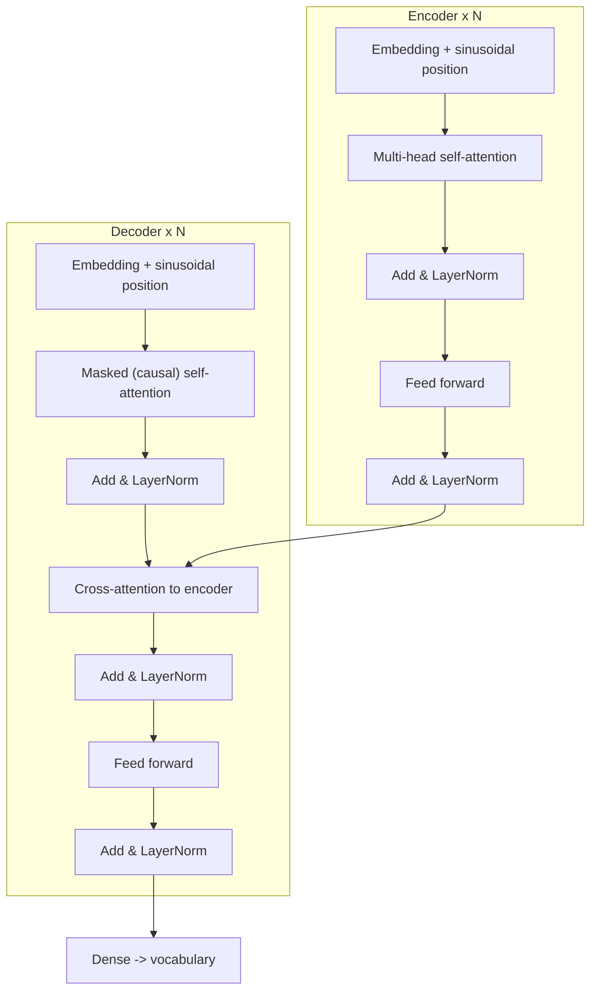

# Conversational Deep Learning Testbed

A lightweight encoder/decoder chatbot in **two architectures** (GRU+attention and a
**transformer**) across **two frameworks** (PyTorch and TensorFlow) — four interchangeable
combinations sharing one corpus, one tokenizer and one training loop, all trainable on a laptop
CPU in a couple of minutes.

## Layout

| File | Role |
|------|------|
| [corpus.py](chatbot/corpus.py) | Intent templates → 900 prompt/response pairs, written to [conversations.jsonl](data/conversations.jsonl) |
| [tokenizer.py](chatbot/tokenizer.py) | Word-level vocabulary, `<pad> <sos> <eos> <unk>`, casing-aware detokenizer |
| [dataset.py](chatbot/dataset.py) | Padding, teacher-forcing shift, train/validation split, batching |
| [config.py](chatbot/config.py) | Backend, architecture, training and generation settings |
| [backends/base.py](chatbot/backends/base.py) | The interface all four models implement + shared sampling |
| [backends/torch_backend.py](chatbot/backends/torch_backend.py) | PyTorch GRU encoder, Luong attention decoder |
| [backends/tf_backend.py](chatbot/backends/tf_backend.py) | The same RNN in Keras with a `GradientTape` step |
| [backends/torch_transformer.py](chatbot/backends/torch_transformer.py) | PyTorch transformer, multi-head attention written from scratch |
| [backends/tf_transformer.py](chatbot/backends/tf_transformer.py) | Keras transformer using `MultiHeadAttention` |
| [trainer.py](chatbot/trainer.py) | The epoch loop: early stopping, best-weight restore, save/load |
| [chat.py](chatbot/chat.py) | Interactive REPL and scripted sample conversation |
| [cli.py](chatbot/cli.py) | `corpus` / `train` / `chat` / `info` / `backends` commands |
| [demo.py](chatbot/demo.py) | Corpus → training → conversation → save → reload, end to end |

## The two architectures

### `--architecture rnn` (default)



The encoder GRU compresses the prompt; the decoder emits one token at a time and **attention**
scores the encoder states (`score = h_decᵀ W h_enc`, padding masked). **Teacher forcing** feeds the
true previous token with probability `--teacher-forcing`, otherwise the model's own prediction.

### `--architecture transformer`



No recurrence at all. Three attention types do the work:

| Attention | Where | Mask |
|-----------|-------|------|
| Self-attention | encoder | padding only — every prompt token sees every other |
| Causal self-attention | decoder | padding **and** lower-triangular, so position `t` cannot peek ahead |
| Cross-attention | decoder | padding of the prompt — this is what grounds the reply in the question |

Each is $\text{softmax}\!\left(\frac{QK^\mathsf{T}}{\sqrt{d_k}}\right)V$ computed over `--heads`
subspaces in parallel. Because the causal mask already prevents look-ahead, the **whole reply is
scored in one forward pass** during training (no teacher-forcing loop) — which is why it converges
in far fewer epochs. Only generation stays sequential.

[torch_transformer.py](chatbot/backends/torch_transformer.py) implements `MultiHeadAttention`,
`PositionalEncoding` and both block types by hand so the maths is visible;
[tf_transformer.py](chatbot/backends/tf_transformer.py) builds the identical network from
`keras.layers.MultiHeadAttention`. Both come out to exactly the same parameter count.

Default sizes:

| Architecture | Shape | Parameters |
|--------------|-------|------------|
| `rnn` | 128 embed, 192 hidden, 1 layer | **697,540** |
| `transformer` | 128 model dim, 4 heads, 512 FF, 2+2 blocks | **1,041,860** |

Loss is cross-entropy with `<pad>` ignored; perplexity is reported as `exp(loss)`.

## Requirements

```powershell
pip install numpy
pip install torch          # either one
pip install tensorflow     # or both
```

## Run it

From the `project1` folder:

```powershell
# which frameworks are installed?
python -m main.dl.chatbot backends

# build / inspect the corpus
python -m main.dl.chatbot corpus --rebuild --show 10

# train (PyTorch GRU), then talk to it
python -m main.dl.chatbot train --backend torch --epochs 60 --save --chat

# train the transformer instead
python -m main.dl.chatbot train --backend torch --architecture transformer --epochs 40 --save

# the same transformer in TensorFlow, with a bigger stack
python -m main.dl.chatbot train --backend tensorflow --architecture transformer `
    --heads 8 --ff-dim 1024 --encoder-layers 3 --decoder-layers 3 --epochs 40

# chat with a saved model
python -m main.dl.chatbot chat --model main/dl/saved_models/chatbot
python -m main.dl.chatbot chat --model main/dl/saved_models/chatbot --samples

# full walkthrough (corpus stats, training, conversation, save, reload)
python -m main.dl.chatbot.demo torch transformer
python -m main.dl.chatbot.demo both all 40      # all four combinations
```

Inside the chat loop: `/greedy`, `/sample`, `/temp 0.9`, `exit`.

## From Python

```python
from main.dl.chatbot import ChatbotConfig, ModelConfig, TrainingConfig, train_chatbot, save_chatbot

config = ChatbotConfig(
    backend="torch",
    model=ModelConfig(
        architecture="transformer",
        embedding_dim=128,
        num_heads=4,
        feedforward_dim=512,
        num_encoder_layers=2,
        num_decoder_layers=2,
    ),
    training=TrainingConfig(epochs=40, batch_size=32, learning_rate=1e-3, patience=15),
)
model = train_chatbot(config)
print(model.summary())
print(model.reply("what is deep learning"))
save_chatbot(model, "main/dl/saved_models/chatbot")
```

Swap `architecture="rnn"` (and add `hidden_dim` / `num_layers`) for the GRU model; everything else
stays the same.

## Using your own corpus

Any JSON Lines file with `prompt`/`response` (or `question`/`answer`, or `input`/`output`) works:

```json
{"prompt": "how do i deploy this", "response": "Export the weights and wrap them in a service."}
```

```powershell
python -m main.dl.chatbot train --corpus path/to/my_corpus.jsonl --epochs 80
```

To extend the bundled corpus instead, add an `Intent` to `INTENTS` in [corpus.py](chatbot/corpus.py)
and run `corpus --rebuild`.

## Typical results

Measured on this machine (900 pairs, 40 epochs, CPU only):

| Backend | Architecture | Time / epoch | Best epoch | Validation loss | Exact reply match |
|---------|--------------|--------------|------------|-----------------|-------------------|
| torch | rnn | ~2.2 s | 37 | 0.0403 | 96.7 % |
| torch | transformer | ~3.6 s | **21** | 0.0317 | 99.2 % |
| tensorflow | rnn | ~1.3 s | 35 | 0.0265 | 99.2 % |
| tensorflow | transformer | ~2.0 s | 40 | **0.0140** | 99.2 % |

The transformer costs more per epoch and more parameters, but reaches a usable model in roughly
half the epochs, because every position is trained in parallel rather than through a recurrent
loop. On a corpus this small both architectures end up answering identically.

The model deliberately **memorises** this small closed-domain corpus — that is the point of the
demo. It shows the full deep learning cycle (tokenise → embed → encode → attend → decode →
backpropagate → early stop → save → infer) without needing a GPU or a large dataset. It is not a
general-purpose language model, and it will fall back to a canned "I am not sure" style reply for
anything outside its 450-word vocabulary.

## Ideas to take it further

* Compare architectures head to head: `python -m main.dl.chatbot.demo torch all 40`.
* Scale the transformer with `--heads`, `--ff-dim`, `--encoder-layers`, `--decoder-layers`.
* Turn RNN attention off with `--no-attention` to see how much it was contributing.
* Lower `--teacher-forcing` (RNN only) to make decoding rely more on its own predictions.
* Swap greedy for `--strategy sampling --temperature 1.0` to see the diversity/accuracy trade-off.
* Add a learning-rate warmup schedule, or cache decoder keys/values to speed up generation.
